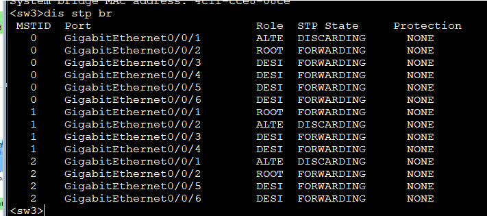
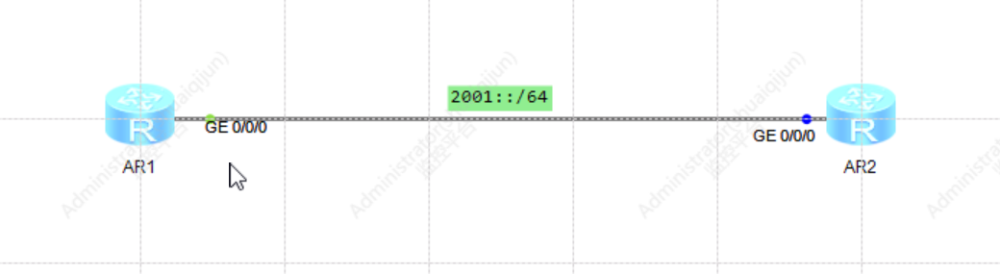

# 一 Lan技术（实验）
## 1 Mac地址表组成
MAC地址分为三种类型：物理MAC地址、[广播](https://baike.baidu.com/item/%E5%B9%BF%E6%92%AD/656406?fromModule=lemma_inlink)MAC地址和[组播](https://baike.baidu.com/item/%E7%BB%84%E6%92%AD/8946116?fromModule=lemma_inlink)MAC地址。物理MAC地址是唯一一个标识以太网终端的地址。广播MAC地址用于向局域网上的所有终端设备发送数据，其所有位都设置为1（即FF-FF-FF-FF-FF-FF）。组播MAC地址用于向局域网上的一组终端设备发送数据，其第8位为1

```
1.动态MAC表项 
	由接口通过报文中的源MAC地址学习获得，表项可以老化，默认老化时间为300秒
	在系统重启复位、接口热插拔或者接口板复位后，动态表项会丢失
	
2.静态MAC表项
	由用户手工配置，并且下发到个接口板，表项不老化
	在系统重启复位、接口板热插拔或接口板复位后，保存的表项不会丢失
	
3.黑洞MAC表项
	由用户手工配置，并且下发个接口板，表项不老化
	配置黑洞MAC地址后，源MAC地址或者目的MAC地址是该MAC的报文将会被丢弃
	
```


### 1.1 查看Mac地址表
```shell
# 查看mac地址表命令：display mac-address

# 如果MAC地址表里没有的MAC地址进行转发，交换机会将此报文作为未知单播，未知单播泛洪。

<Huawei>display mac-address
MAC address table of slot 0:
-------------------------------------------------------------------------------
MAC Address    VLAN/       PEVLAN CEVLAN Port            Type      LSP/LSR-ID  
               VSI/SI                                              MAC-Tunnel  
-------------------------------------------------------------------------------
5489-985a-4adc 1           -      -      GE0/0/1         dynamic   0/-         
5489-989d-23fd 1           -      -      GE0/0/3         dynamic   0/-         
-------------------------------------------------------------------------------
Total matching items on slot 0 displayed = 2 

```

### 1.2 修改Mac地址表老化时间
```shell
# 华为交换机默认MAC地址表老化时间300秒

# 修改mac地址表命令：mac-address aging-time 300

[Huawei]mac-address aging-time ?
  <0,10-1000000>  Aging-time seconds, 0 means that MAC aging function does not
                  work

[Huawei]mac-address aging-time 500
```

### 1.3 静态Mac表项
```shell
# 修改mac地址表命令：mac-address static 5489-9824-47DC GigabitEthernet 0/0/4 vlan 1
# 表项不会消失

[Huawei]mac-address static 5489-9824-47DC GigabitEthernet 0/0/4 vlan 1

[Huawei]display mac-address
MAC address table of slot 0:
-------------------------------------------------------------------------------
MAC Address    VLAN/       PEVLAN CEVLAN Port            Type      LSP/LSR-ID  
               VSI/SI                                              MAC-Tunnel  
-------------------------------------------------------------------------------
5489-9824-47dc 1           -      -      GE0/0/4         static    -           
-------------------------------------------------------------------------------
Total matching items on slot 0 displayed = 1 

```

### 1.4 黑洞Mac表项
```shell
# 配置黑洞mac地址表命令：mac-address blackhole 5489-982C-3207 vlan 1
# 表项不会消失

[Huawei]mac-address blackhole 5489-982C-3207 vlan 1

[Huawei]display mac-address
MAC address table of slot 0:
-------------------------------------------------------------------------------
MAC Address    VLAN/       PEVLAN CEVLAN Port            Type      LSP/LSR-ID  
               VSI/SI                                              MAC-Tunnel  
-------------------------------------------------------------------------------
5489-9824-47dc 1           -      -      GE0/0/4         static    -           
5489-982c-3207 1           -      -      -               blackhole -           
-------------------------------------------------------------------------------
Total matching items on slot 0 displayed = 2 
```


### 1.5 配置Mac地址学习优先级
```shell
# 防止Mac漂移，防止环路、防止Mac仿冒攻击
[Huawei]interface g0/0/1
[Huawei-GigabitEthernet0/0/1]mac-learning priority 1

# 配置不允许相同优先级的接口发生Mac地址漂移
[Huawei]undo mac-learning priority 3 allow-flapping

# 配置全局mac地址漂移检测（默认开启）
[Huawei]mac-address flapping detection

```

### 1.6 MAC地址漂移
MAC地址漂移是指设备上一个vlan内有俩个端口学习到同一个MAC地址，后学习到的MAC地址表项覆盖原有MAC地址表项的现象

```
MAC地址漂移避免机制：
1.提高接口MAC地址学习优先级
2.不允许相同优先级的几口发生
3.MAC地址表项覆盖
```

```
# 配置不允许相同优先级接口MAC地址漂移
[Huawei]undo mac-learning priority 3 allow-flapping

# 配置全局MAC地址漂移检测
[Huawei]mac-address flapping detection


```

### 1.7 免费ARP、代理ARP
设备主动使用自己的IP地址作为目的IP地址发送ARP请求，这种方式称之为免费ARP

```
免费ARP作用：
1. IP地址冲突检测
2. VRRP主备切换检测
3. server主备检测
4. IP、MAC地址更改
```

什么是代理ARP
```
俩个主机相同网段但不在同一物理网络（不在同一个广播域），此时俩主机互访需要中间网络设备代替主机发送arp响应，该过程称为ARP代理。
```

arp代理类型的应用或场景
```
1. 路由式arp代理：中间 路由器
2. vlan间arp代理：super-vlan
3. vlan内arp代理：端口隔离
```


```shell
#
interface GigabitEthernet0/0/0
 ip address 192.168.1.1 255.255.0.0 
 arp-proxy enable
#
interface GigabitEthernet0/0/1
 ip address 192.168.2.1 255.255.255.0 
 arp-proxy enable
```


```shell
# 端口隔离，ARP代理，单播互通，广播隔离。
#
interface Vlanif10
 ip address 172.16.10.1 255.255.255.0
 arp-proxy inner-sub-vlan-proxy enable

# 端口隔离组1
interface GigabitEthernet0/0/1
 port link-type access
 port default vlan 10
 port-isolate enable group 1
#
interface GigabitEthernet0/0/2
 port link-type access
 port default vlan 10
 port-isolate enable group 1
#
interface GigabitEthernet0/0/3
 port link-type access
 port default vlan 10
 port-isolate enable group 1
```


交换机2口已经无法接收到DHCP广播报文
### 1.8 端口安全

端口安全（port security）通过将接口学习到的动态MAC地址转换成为安全MAC地址（包括安全动态MAC、安全静态MAC和Sticky Mac），阻止非法用户通过本接口和交换机通信，从而增强设备的安全性。

```
安全MAC地址分类
	1.安全动态MAC地址
		使能端口安全而未使能Sticky MAC功能时转换的MAC地址
		
		默认只允许一个MAC地址，接口down后表项消失
		
		[Huawei-GigabitEthernet0/0/2]port-security enable
		[Huawei]display mac-address
		MAC address table of slot 0:
		-------------------------------------------------------------------------------
		MAC Address    VLAN/       PEVLAN CEVLAN Port            Type      LSP/LSR-ID  
		               VSI/SI                                              MAC-Tunnel  
		-------------------------------------------------------------------------------
		5489-9860-1fc2 1           -      -      GE0/0/2         security  -           
		-------------------------------------------------------------------------------
		Total matching items on slot 0 displayed = 1 
		
		MAC address table of slot 0:
		-------------------------------------------------------------------------------
		MAC Address    VLAN/       PEVLAN CEVLAN Port            Type      LSP/LSR-ID  
		               VSI/SI                                              MAC-Tunnel  
		-------------------------------------------------------------------------------
		5489-987b-5b33 1           -      -      GE0/0/1         dynamic   0/-         
		-------------------------------------------------------------------------------
		Total matching items on slot 0 displayed = 1 
		
	2.安全静态MAC地址
		使能端口安全时手工配置的静态MAC地址
		
	3.Sticky MAC地址
		使能端口安全后又同时使能Sticky MAC功能后转换到的MAC地址

```


## 2 STP
STP协议（Spanning Tree Protocol生成树协议）逻辑上断开环路，通过阻塞特定的端口来防止二层网络的广播风暴的产生。

交换机环路带来的问题：
```
1.广播风暴

2.mac地址表不稳定

3.网络卡顿

4.网络不稳定等
```

### 2.1 stp协议介绍
当线路出现故障，断开的接口被激活，恢复通信，起备份线路的作用

生成树协议是IEEE 802.1D中定议的数据链路层协议，用于解决在网络的核心层构建冗余链路里产生的网络环路问题，通过在交换机之间传递网桥协议数据单元（Bridge Protocol Data Unit，简称BPDU），通过采用STA生成树算法选举根桥、根端口和指定端口的方式，最终将网络形成一个树形结构的网络，其中，根端口、指定端口都处于转发状态，其他端口处于禁用状态。如果网络拓扑发生改变，将重新计算生成树拓扑。生成树协议的存在，既解决了核心层网络需要冗余链路的网络健壮性要求，又解决了因为冗余链路形成的物理环路导致“广播风暴”问题。
### 2.2 原理
STP的作用是通过阻断冗余链路，使一个有回路的桥接网络修剪成一个无回路的树形拓扑结构。
整体思路：先选出哪些接口不被阻塞，最终剩下的接口全部被阻塞
### 2.3 算法
```
STP将一个环形网络生成无环拓朴的步骤：

选择根桥（Root Bridge）

选择根端口（Root Ports）

选择指定端口（Designated Ports）
```

```
选举根端口：RPC---------->BID-------------->PID-------------->本端PID
           开销值------->対端桥ID---------->対端端口ID-------->本端端口ID

选举指定端口：RPC---------->本端BID-------------->本端PID
```

```shell
BPDU：bridge protocol data unit ，就是stp报文，根桥每隔2s发送一次。报文里面含有BID、链
路cost开销等等。对于stp报文

目标MAC地址始终是：01:08:C2:00:00:00，属于组播mac地址。

display stp brief 、display stp interface g0/0/0 查看接口状态、接口角色。

最终如果收到的BPDU报文所有参数都一样，此时交换机会比较本端PID。
```

```
A：整个交换玩路过选举根桥（根交换机Root Bridge），桥ID较小的交换机当选为根桥。桥ID=桥优先级+桥MAC。根桥上的接口都是指定端口（DP：Designated Ports）

注意：桥ID（BID）=桥优先级+桥MAC，桥优先级默认都是32768，桥MAC是主板MAC
端口ID（PID）=端口优先级+端口ID，端口优先级默认为128，端口ID就是端口编号 G0/0/5 ID就是5

B：非根桥上选择根端口，到达根桥“最近”（RPC值）的端口当选为根端口（RP：Root Ports）

C：每条链路有且仅有一个指定端口。桥ID较小的交换机端口当选为指定端口

D：剩下的接口将全部被阻塞，阻塞端口简称：block port (AP：alternate port 或者NDP)

```

查看交换机背板MAC地址命令：display bridge mac-address
注意：华为交换机默认开启STP功能（mstp）,防环技术！undo stp enable 禁用stp
### 2.4 种类
1. stp: 传统stp
2. RSTP:快速生成树协议 rapid stp
3. MSTP:多生成树协议 multi stp (针对多vlan)

| 生成树协议    | 特点                                                                          |
| :------- | :-------------------------------------------------------------------------- |
| STP      | 形成一棵无环路的树，解决广播风暴并实现冗余备份。<br><br>收敛速度较慢。                                     |
| RSTP     | 形成一棵无环路的树，解决广播风暴并实现冗余备份。<br><br>收敛速度快。                                      |
| MSTP<br> | 形成一棵无环路的树，解决广播风暴并实现冗余备份。<br>收敛速度快。<br>多棵生成树在VLAN间实现负载均衡，不同VLAN的流量按照不同的路径转发。 |
### 2.5 STP与RSTP端口状态角色对应表
```
STP端口角色：
1. DP 指定端口 designate port
2. RP 根端口 root port
3. block 阻塞端口

RSTP端口角色
1. DP 指定端口 designate port
2. RP 根端口 root port
3. AP Alternate port 备用端口，AP端口就是由于学习到其它网桥发送的BPDU配置报文而阻塞的端口，它提供了从指定桥到根的另一条可切换路径，作为根端口的备份端口。
4. BP Backup port 备份端口，BP端口就是由于学习到自己发送的的配置BPDU报文而阻塞的端口，它作为指定端口的备份。

总结：AP是RP备份，BP是DP的备份，一当交换机收到自己所发出来的BPDU报文（比如自环），就会出现BP接口的情况。
```

| STP端口状态    | RSTP端口状态   | 端口在拓扑中的角色              | 目的                               | 说明                         |
| ---------- | ---------- | ---------------------- | -------------------------------- | -------------------------- |
| Forwarding | Forwarding | 包括根端口、指定端口             | 端口既转发用户流量也处理BPDU报文               | 只有根端口或指定端口才能进入Forwarding状态 |
| Learning   | Learning   | 包括根端口、指定端口             | 设备会根据收到的用户流量构建MAC地址表，但是不转发用户流量   | 过渡状态，增加Learing状态防止临时环路     |
| Listening  | Discarding | 包括根端口、指定端口             | 确定端口角色，将选举出根桥、根端口和指定端口，可收发BPDU报文 | 过渡状态                       |
| Blocking   | Discarding | 包括Alternate端口、Backup端口 | 端口仅仅接受并处理BPDU，不转发用户流量，不能转发BPDU   | 阻塞端口的最终状态                  |
| Disabled   | Discarding | 包括Disable端口            | 端口不仅不处理BPDU报文，也不转发用户流量           | 端口状态为Down                  |

### 2.6 stp-edged-port
rstp新提出的一种端口，边缘端口，主要用于连接PC和终端。作用：加快收敛。
```shell
[ ]stp edged-port default //将所有端口配置为边缘端口
stp edged-port enable //将当前端口配置为边缘端口
stp edged-port disable
```


当前端口设置成边缘端口后，如果收到BPDU报文，交换机会自动将边缘端口设置为非边缘端口。

### 2.7 修改桥优先级
```
修改桥优先级：stp priority 4096

             stp root primary 交换机会自动降低优先级使自己称为根桥

             stp root second

[Huawei]stp priority ?

  INTEGER<0-61440>  Bridge priority, in steps of 4096

更改桥优先级，步长为4096.

[Huawei-GigabitEthernet0/0/1]stp port priority ?

  INTEGER<0-240>  Port priority, in steps of 16

更改端口优先级（PID），步长为16

[Huawei-GigabitEthernet0/0/1]stp cost ?

更改cost值
```


### 2.8 RSTP

```

```

```shell
# 配置底层vlan和trunk（每台交换机上的VLAN要保持一致）

[sw1]vlan batch 2 3 4 5
[sw1]port-group group-member g0/0/1 to g0/0/2
[sw1-port-group]port link-type trunk
[sw1-GigabitEthernet0/0/1]port link-type trunk
[sw1-GigabitEthernet0/0/2]port link-type trunk
[sw1-port-group]port trunk allow-pass vlan 2 3 4 5
[sw1-GigabitEthernet0/0/1]port trunk allow-pass vlan 2 3 4 5
[sw1-GigabitEthernet0/0/2]port trunk allow-pass vlan 2 3 4 5
[sw1]dis stp region-configuration

 Oper configuration

   Format selector    :0            

   Region name        :4c1fcc2f1acd            

   Revision level     :0

   Instance   VLANs Mapped

      0       1 to 4094

[sw2]vlan batch 2 to 5
[sw2]port-g group-member g0/0/1 to g0/0/2
[sw2-port-group]port link-type trunk
[sw2-GigabitEthernet0/0/1]port link-type trunk
[sw2-GigabitEthernet0/0/2]port link-type trunk
[sw2-port-group]port trunk allow-pass vlan 2 3 4 5
[sw2-GigabitEthernet0/0/1]port trunk allow-pass vlan 2 3 4 5
[sw2-GigabitEthernet0/0/2]port trunk allow-pass vlan 2 3 4 5
[sw2]dis stp region-configuration

 Oper configuration

   Format selector    :0            

   Region name        :4c1fcce31e1f            

   Revision level     :0

   Instance   VLANs Mapped

      0       1 to 4094

[sw3]vlan batch 2 3 4 5
[sw3]port-group group-member g0/0/3 to g0/0/6
[sw3-port-group]port link-type access
[sw3-GigabitEthernet0/0/3]port link-type access
[sw3-GigabitEthernet0/0/4]port link-type access
[sw3-GigabitEthernet0/0/5]port link-type access
[sw3-GigabitEthernet0/0/6]port link-type access
[sw3-port-group]quit
[sw3]interface g0/0/3
[sw3-GigabitEthernet0/0/3]port default vlan 2
[sw3-GigabitEthernet0/0/3]interface g0/0/4
[sw3-GigabitEthernet0/0/4]port default vlan 3
[sw3-GigabitEthernet0/0/4]interface g0/0/5
[sw3-GigabitEthernet0/0/5]port default vlan 4
[sw3-GigabitEthernet0/0/5]interface g0/0/6
[sw3-GigabitEthernet0/0/6]port default vlan 5
[sw3-GigabitEthernet0/0/6]interface g0/0/1
[sw3-GigabitEthernet0/0/1]port link-type trunk
[sw3-GigabitEthernet0/0/1]port trunk allow-pass vlan 2 3 4 5
[sw3-GigabitEthernet0/0/1]interface g0/0/2
[sw3-GigabitEthernet0/0/2]port link-type trunk
[sw3-GigabitEthernet0/0/2]port trunk allow-pass vlan 2 3 4 5

# 所有交换机mstp配置
[sw1]stp region-configuration     //进入mstp配置界面
[sw1-mst-region]region-name aa  //mstp域名
[sw1-mst-region]revision-level 1
[sw1-mst-region]instance 1 vlan 2 3
[sw1-mst-region]instance 2 vlan 4 5
[sw1-mst-region]active region-configuration //激活mstp配置
[sw1]stp instance 1 root primary   //sw1设置为组1的根桥
[sw1]stp instance 2 root secondary  //sw1设置为组2的备份根桥
[sw1]stp instance 1 priority ?    //修改sw1组1优先级

  INTEGER<0-61440>  Bridge priority, in steps of 4096

stp region-configuration 

region-name aa

revision-level 1

instance 1 vlan 2 3

instance 2 vlan 4 5

[sw2]stp region-configuration 
[sw2-mst-region]region-name aa
[sw2-mst-region]revision-level 1
[sw2-mst-region]instance 1 vlan 2 3
[sw2-mst-region]instance 2 vlan 4 5
[sw2-mst-region]active region-configuration
[sw2]stp instance 2 root primary   //sw2设置为组2的根桥
[sw2]stp instance 1 root secondary  //sw2设置为组1的备份根桥
[sw2-mst-region]display this

#
stp region-configuration

 region-name aa

 revision-level 1

 instance 1 vlan 2 to 3

 instance 2 vlan 4 to 5

 active region-configuration

#

[sw3]stp region-configuration 
[sw3-mst-region]region-name aa
[sw3-mst-region]revision-level 1
[sw3-mst-region]instance 1 vlan 2 3
[sw3-mst-region]instance 2 vlan 4 5
[sw3-mst-region]active region-configuration
[sw3]display stp instance 1

-------[MSTI 1 Global Info]-------

MSTI Bridge ID      :32768.4c1f-cc32-0273

MSTI RegRoot/IRPC   :0.4c1f-cc2f-1acd / 20000

MSTI RootPortId     :128.1

Master Bridge       :32768.4c1f-cc2f-1acd

Cost to Master      :20000

TC received         :3

TC count per hello  :0

Time since last TC  :0 days 0h:8m:22s

Number of TC        :5

Last TC occurred    :GigabitEthernet0/0/1

 ----[Port1(GigabitEthernet0/0/1)][FORWARDING]----

 Port Role           :Root Port

 Port Priority       :128

 Port Cost(Dot1T )   :Config=auto / Active=20000

 Designated Bridge/Port   :0.4c1f-cc2f-1acd / 128.1

 Port Times          :RemHops 20

 TC or TCN send      :2

 TC or TCN received  :2

 ----[Port2(GigabitEthernet0/0/2)][DISCARDING]----

 Port Role           :Alternate Port

 Port Priority       :128

 Port Cost(Dot1T )   :Config=auto / Active=20000

 Designated Bridge/Port   :4096.4c1f-cce3-1e1f / 128.2

 Port Times          :RemHops 19

 TC or TCN send      :2

 TC or TCN received  :1

 ----[Port3(GigabitEthernet0/0/3)][FORWARDING]----

 Port Role           :Designated Port

 Port Priority       :128

 Port Cost(Dot1T )   :Config=auto / Active=20000

 Designated Bridge/Port   :32768.4c1f-cc32-0273 / 128.3

 Port Times          :RemHops 19

 TC or TCN send      :4

 TC or TCN received  :0

 ----[Port4(GigabitEthernet0/0/4)][FORWARDING]----

 Port Role           :Designated Port

 Port Priority       :128

 Port Cost(Dot1T )   :Config=auto / Active=20000

 Designated Bridge/Port   :32768.4c1f-cc32-0273 / 128.4

 Port Times          :RemHops 19

 TC or TCN send      :4

 TC or TCN received  :0

[sw3]dis stp brief

 MSTID  Port                        Role  STP State     Protection

   0    GigabitEthernet0/0/1        ROOT  FORWARDING      NONE

   0    GigabitEthernet0/0/2        DESI  FORWARDING      NONE

   0    GigabitEthernet0/0/3        DESI  FORWARDING      NONE

   0    GigabitEthernet0/0/4        DESI  FORWARDING      NONE

   0    GigabitEthernet0/0/5        DESI  FORWARDING      NONE

   0    GigabitEthernet0/0/6        DESI  FORWARDING      NONE

   1    GigabitEthernet0/0/1        ROOT  FORWARDING      NONE

   1    GigabitEthernet0/0/2        ALTE  DISCARDING      NONE

   1    GigabitEthernet0/0/3        DESI  FORWARDING      NONE

   1    GigabitEthernet0/0/4        DESI  FORWARDING      NONE

   2    GigabitEthernet0/0/1        ALTE  DISCARDING      NONE

   2    GigabitEthernet0/0/2        ROOT  FORWARDING      NONE

   2    GigabitEthernet0/0/5        DESI  FORWARDING      NONE

   2    GigabitEthernet0/0/6        DESI  FORWARDING      NONE

[sw3]display stp region-configuration

 Oper configuration

   Format selector    :0            

   Region name        :aa            

   Revision level     :1

   Instance   VLANs Mapped

      0       1, 6 to 4094

      1       2 to 3

      2       4 to 5

注意：每个实例使用独立的RSTP算法
```


### 2.9 RSTP改进

![]../../01-Images/(Pasted%20image%2020241204194240.png)


### 2.10 PA机制详解


### 2.11 PA机制实验


### 2.12 拓扑变更机制


### 2.13 保护功能


```shell
# 开启全局BPDU保护功能
全局： stp bpdu-protection

# 自动恢复<10秒后自动恢复>
全局： error-down auto-recovery cause bpdu-protection interval 10
```


```shell
指定接口开启根保护功能：接口下 stp root-protection
```


```shell
# 设置tc bpdu报文阙值
[SW1]stp tc-protection threshold ?
  INTEGER<1-255>  The threshold of TC-BPDU protection, default is 1
```
### 2.14 MSTP
```
stp、rstp缺点：收敛慢、对于大二层环境支持较弱、运行卡顿。

它们还存在着同一个缺陷：由于局域网内所有的vlan共享一棵生成树，因此无法再vlan间实现数据流量的负载均衡，链路被阻塞后将不再承载任何流量，还有可能造成部分vlan的报文无法转发。

可以替代的技术：eth-trunk、istack、css、svf、trill和vxlan.
```


```
华为交换机：出厂默认运行mstp协议，默认情况下所有的vlan都属于组0（instance 0 默认实例），默认的mstp域名是交换机的桥MAC地址。

instance 0：默认实例  默认所有的VLAN归属于instance 0
```

```
MST域（Multiple Spanning Tree Regions，多生成树域）是由交换网络中的多台交换机以及它们之间的网段构成（在Cisco中是叫“MST区域”）。这些交换机都启动了MSTP、具有相同的域名、相同的VLAN到生成树映射（是一个描述了VLAN和MSTI之间映射关系的映射表）配置和相同的MSTP修订级别配置，并且物理上有链路连通。

一个局域网中可以存在多个MST域，各MST域之间在物理上直接或间接相连。用户可以通过MSTP配置命令把多台交换机划分在同一个MST域内。

MSTI（Multiple Spanning Tree Instance，多生成树实例）是指MST域内的生成树。一个MST域内可以通过MSTP生成多棵生成树，各棵生成树之间彼此独立。一个MSTI可以与一个或者多个VLAN对应，但一个VLAN只能与一个MSTI对应。

既然是生成树，那就不允许存在环路。
```

```
MST域是多生成树域，由交换网络中的多台交换设备以及它们之间的网段所构成，同一个MST域的设备具有以下特点：

1.都启动了MSTP

2.都具有相同的域名

3.具有相同的VLAN到生成树实例映射配置

4.具有相同的MSTP修订级别配置
```

```
MSTP是IEEE802.1S中定义的生成树协议，MSTP兼容STP和RSTP，既可以快速收敛，又提供了数据转发的多个冗余路径，在数据转发过程中实现vlan数据的负载均衡。

MSTP可以将一个或者多个Vlan映射到一个instance（实例），再基于instance计算生成树，映射到同一个instance的vlan共享同一棵生成树。
```


查看region-configuration配置
```shell
<SW1>display stp region-configuration
 Oper configuration
   Format selector    :0             
   Region name        :HUAWEI             
   Revision level     :0

   Instance   VLANs Mapped
      0       3 to 4094
      1       1
      2       2
```
### 2.15 MST Region

### 2.16 MST Instance

### 2.17 CST

### 2.18 IST

### 2.19 CIST

### 2.20 SST

### 2.21 总根、域根和主桥

```shell
总根(CISTRoot)
	是CIST的根桥，如图中SW1。

域根(Regional Root)
	分为IST域根和MSTI域根。
	1.IST域根，在MST域中IST生成树中距离总根最近的交换设备是IST域根，如图中SW2、SW3、SW4。
	
	注意:IST域根并不是IST域内桥ID最小的交换机。
	
	2.MSTI域根是每个多生成树实例的树根。

主桥(Master Bridge)
	是ISTMaster，它是域内距离总根最近的交换设备，如图中SW1、SW2、SW3、SW4。
	如果总根在MST域中，则总根为该域的主桥。
	主桥包括总根和IST域根。
```

```shell
# 总根
[SW1]stp priority 0
#
stp instance 0 priority 0
```


### 2.22 MSTP拓扑计算

MSPT拓扑计算步骤：
1. 找总根
2. 选主桥
3. CST master bridge互相发送stp，将域看成一台交换机
4. IST（各域独立计算internal）
5. MSTI（各域各实例独立计算）

```

ERPC(外部路径开销【域间开销】):从CIST的域根到达总根的路径开销。MST域内所有交换设备上保存的外部路径开销相同。若CST根交换设备在域中，则域内所有交换设备上保存的外部路径开销为0。

PS：同一个域的交换机到达总根的ERPC开销相同
```

```

IRPC(内部路径开销):本桥（自身）到达域根的路径开销。域边缘端口保存的内部路径开销大于非域边缘端口保存的内部路径开销。

```


### 2.23 MSTP端口角色和端口状态


### 2.24 MSTP报文


## 3 其他破环技术
### 3.1 RRPP
#### 3.1.1 定义
快速环网保护协议（RRPP，Rapid Ring Protection Protocol）是一种专门用于破除以太网数据环路的链路层(二层)协议。

在网络完整时，运行该协议的设备通过检测网络中是否存在环路，适时对某些接口进行阻塞以消除环路。在网络发生故障时，运行该协议的设备会打开某些阻塞的接口，使得数据流量切换到正常的链路上。
#### 3.1.2 目的
在城域网和企业网的网络规划以及实际组网应用中大多会采用环网结构来提高网络的可靠性。采用环网结构的好处是：当环上任意一个节点或节点之间的链路发生故障，都可以将数据流量切换到备份链路上，以保障业务的顺利进行。但采用环网结构同时也会带来广播风暴的问题。

目前，已经有多种协议可以用来解决环路广播风暴的问题。但是在环网中，当故障发生时，数据流量切换到备份链路（即网路收敛）还需要一定的时间，如果收敛时间过长，也会对业务造成影响。

为了缩短收敛时间，消除网络大小对收敛速度的影响，华为公司开发了专门应用于环网保护的RRPP协议。如[表1](https://support.huawei.com/hedex/api/pages/EDOC1100407952/AZN1008K/02/resources/dc/dc_fd_rrpp_0001.html#ZH-CN_CONCEPT_0177103514__tab_dc_fd_rrpp_0001)所示，相比其他以太环网技术，RRPP具有以下优势：

- 收敛时间与环网上节点数无关，可应用于网络节点较多的网络。
    
- 在以太网环完整时能够防止数据环路引起的广播风暴。
    
- 当以太网环上一条链路断开时能迅速启用备份链路以恢复环网上各个节点之间的通信通路。


**表1 环网协议特性比较**

| 环网协议          | 特点                                                                                                                                                                                                                                                                                                                                             |
| ------------- | ---------------------------------------------------------------------------------------------------------------------------------------------------------------------------------------------------------------------------------------------------------------------------------------------------------------------------------------------- |
| Token Ring    | Token Ring是最早引入数据通信领域里面的环网技术，一般用于局域网。<br><br>Token Ring不具备故障自愈的保护功能。                                                                                                                                                                                                                                                                           |
| FDDI          | <br>\|FDDI（Fiber Distributed Digital Interface）可以说是一种改进的Token Ring技术，也是利用令牌来传递对环网的控制权，所不同的是，FDDI采用了双环的结构。<br><br>FDDI采用光纤作为传输介质，在性能和效率上都较Token Ring有很大提高。与Token Ring一样，FDDI并不具备故障自愈的保护功能。<br><br>由于采用源地址剥离技术，FDDI环网的带宽得不到有效利用。\|                                                                                                               |
| SDH/SONET     | SDH/SONET（Synchronous Digital Hierarchy/Synchronous Optical Network）是目前广泛应用在传输网络里面的一种环网技术，单环、多环都支持。具有高可靠性，能提供故障自动保护倒换APS（Automatic Protection Switching）的故障自愈机制。<br><br>由于其点到点、电路交换的设计，带宽在节点间的链路中固定分配并保留，不能根据网络中流量的实际情况而改变带宽，不利于带宽的高效利用，很难适应具有突发性特点的IP数据业务。<br><br>SDH/SONET环网中的广播和组播报文被分成多个单播报文传输，带宽浪费严重，而且对于APS特性，需要最高多达50%冗余带宽，不能提供灵活的选择机制。 |
| RPR           | RPR（Resilient Packet Ring）是国际标准化IEEE 802.17 工作组和RPR联盟研究并规范化的一种环网拓扑上使用的MAC层协议。RPR的设计目标定义了一个闭合环路、点到点、基于MAC层的逻辑环状拓扑。<br><br>对于物理层来说，RPR就是一组点到点的链路；而对于数据链路层来说，RPR是一个类似于Ethernet的广播介质网络。<br><br>RPR需要专用硬件支持，公平算法比较复杂。                                                                                                                               |
| STP/RSTP/MSTP | STP(Spanning Tree Protocol)/RSTP(Rapid Spanning Tree Protocol)/MSTP(Multi-Spanning Tree Protocol)<br><br>形成一棵无环路的树，解决广播风暴并实现冗余备份。<br><br>MSTP支持多棵生成树在VLAN间实现负载均衡，不同VLAN的流量按照不同的路径转发。<br><br>自计算协议，支持任意拓扑。<br><br>收敛时间受网络拓扑影响。                                                                                                                  |
| RRPP          | RRPP(Rapid Ring Protection Protocol)<br><br>收敛时间与环网上节点数无关，收敛速度快。<br><br>RRPP多实例支持不同业务流量负载均衡。<br><br>RRPP是华为私有协议。                                                                                                                                                                                                                               |
#### 3.1.3 RRPP基本概念
在划分了RRPP域和RRPP环之后，RRPP协议通过将环网上的设备配置为RRPP环上不同角色的节点，各个节点之间通过主、副端口收发和处理RRPP协议报文来检测环网状态，传递环网拓扑变化信息。环上节点根据环网状态适时的阻塞或放开其端口，在环网完整时可以消除环路；在环网上设备或链路发生故障时，可以迅速启用备份链路，保障业务顺利进行。
#### 3.1.4 RRPP的组成
RRPP协议计算和控制的拓扑范围（即RRPP域，RRPP Domain）是由一组配置了相同的域ID和控制VLAN，且相互连通的交换机群体构成。

如[图1](https://support.huawei.com/hedex/api/pages/EDOC1100407952/AZN1008K/02/resources/dc/dc_fd_rrpp_0003.html#ZH-CN_CONCEPT_0177103516__fig_dc_fd_rrpp_000301)所示，一个RRPP域可以有以下组成元素：

**图1 RRPP组网示意图**


#### 3.1.5 RRPP域ID
RRPP域ID是一个RRPP域区别于另一个RRPP域的特征。
#### 3.1.6 RRPP环
一个RRPP环物理上对应一个环形连接的以太网拓扑。每个RRPP环都是其所在的RRPP域的一个局部单元。

一个RRPP域可以由单个RRPP环构成，也可以由一个主环加若干个子环构成。一个RRPP域中，可以有多个RRPP子环，但是只能有一个RRPP主环。[图1](https://support.huawei.com/hedex/api/pages/EDOC1100407952/AZN1008K/02/resources/dc/dc_fd_rrpp_0003.html#ZH-CN_CONCEPT_0177103516__fig_dc_fd_rrpp_000301)中的RRPP域由一个主环和一个子环组成。

RRPP环物理拓扑常见的三种组网形式为：单环、相交环、相切环。详细信息请参见[RRPP中常见的环组](https://support.huawei.com/hedex/api/pages/EDOC1100407952/AZN1008K/02/resources/dc/dc_fd_rrpp_0003.html#ZH-CN_CONCEPT_0177103516__section_fd_rrpp_000302)。
#### 3.1.7 控制Vlan（Control vlan）和数据vlan （Data vlan)
控制VLAN是相对于数据VLAN来说的。在RRPP域中，控制VLAN只用来传递RRPP协议报文。与控制VLAN相对，数据VLAN用来传输数据报文。

当一个RRPP域中包含主环和子环时，该RRPP域配有两个控制VLAN，分别为主控制VLAN和子控制VLAN。主环的控制VLAN称为主控制VLAN，子环的控制VLAN称为子控制VLAN。配置时只需要指定主控制VLAN，设备会自动把比主控制VLAN的ID值大1的VLAN作为子控制VLAN。

主环协议报文在主控制VLAN中传播，子环协议报文在子控制VLAN中传播。子环的协议报文在主环中作为数据报文传送。例如，当主环主节点副端口被阻塞时，不仅要禁止数据报文通过，同时要禁止子环的协议报文通过。副端口开放时，则同时转发数据报文和子环协议报文。也就是说，子环协议报文在主环中视为数据报文处理。主环协议报文只在主环中传送。
#### 3.1.8 节点
- 主节点
    
    主节点是网络拓扑发生改变后执行操作的决策者。每个RRPP环上必须有且只能有一个主节点。
    
    选择以太网环上的哪一台设备作为主节点是没有限制的。
    
    主节点有Complete State（健康状态）和Failed State（故障状态）2种状态。主节点的状态反映了整个RRPP环的状态。
    
- 传输节点
    
    在RRPP环中，除了主节点以外的其他节点都是传输节点。传输节点负责监测自己的直连RRPP链路的状态，并把链路变化通知主节点。
    
    传输节点有Link-Up State、Link-Down State和Preforwarding State3种状态。
    
    - 传输节点的主端口和副端口都处于Up状态时，传输节点处于Link-Up状态，可以接收、转发数据报文和RRPP协议报文。
        
    - 传输节点的主端口或副端口处于Down状态时，传输节点处于Link-Down状态。
        
    - 传输节点的主端口或副端口处于阻塞状态时，传输节点处于Preforwarding状态，只能接收、转发RRPP协议报文。
        
- 边缘节点和辅助边缘节点
    
    边缘节点（Edge Node）和辅助边缘节点（Assistant-Edge Node）都是交换机在子环上的角色，其在主环上的角色仍为传输节点。
    
    主环与子环相交重合的一段链路上，该段链路上两端的设备可以任选一个作为边缘节点；如果一个被指定为边缘节点，则另外一个就是辅助边缘节点。
    
    一个子环中，有且只能有一个边缘节点和一个辅助边缘节点。
    
    边缘节点和辅助边缘节点都是特殊的传输节点，因此具有与传输节点相同的3种状态，但含义稍有不同，具体如下：
    
    - 边缘端口处于Up状态时，说明边缘节点或辅助边缘节点处于Link-Up状态，可以接收、转发数据报文和RRPP协议报文。
        
    - 边缘端口处于Down状态时，说明边缘节点或辅助边缘节点处于Link-Down状态。
        
    - 边缘端口处于阻塞状态时，说明边缘节点或辅助边缘节点处于Preforwarding状态，只能接收、转发RRPP协议报文。
        
    
    边缘节点或辅助边缘节点在端口链路状态变化导致状态迁移时，只处理边缘端口的状态。

**注意：在RRPP环中，节点RRPP环的状态即是该节点的状态。**
#### 3.1.9 端口
- 主端口和副端口
    
    主节点和传输节点接入以太网环的两个端口中，一个为主端口（Primary Port），另一个为副端口（Secondary Port），端口的角色由用户的配置决定。
    
    主节点的主端口和副端口在功能上区别如下：
    
    - 主节点从其主端口发送Hello报文，从副端口接收Hello报文。
        
    - 主节点根据网络状况，会阻塞副端口以防止数据环路或打开副端口以保证环上所有节点的正常通信。
        
    
    传输节点的主端口和副端口在功能上没有区别。
    
- 公共端口和边缘端口
    
    在边缘节点或辅助边缘节点中，子环和主环共用的端口称为公共端口，只为子环所用的端口称为边缘端口。
    
    公共端口被看作是主环的端口，同时属于主控制VLAN和子控制VLAN。边缘端口只属于子控制VLAN。
#### 3.1.9 RRPP中常见的环组
RRPP环物理拓扑常见的三种组网形式为：单环、相交环、相切环。每种组网形式划分RRPP域的方案不同：

- 单环上的所有设备要配置在相同的RRPP域中。
- 相交环上的所有设备也要配置在相同的RRPP域中。
- 相切的两个环，每个环上的设备要配置在不同的RRPP域中，即相切环相当于两个单环，需要配置两个RRPP域，每个RRPP域中只有一个环。

**单环**
单环组网示意图


物理网络拓扑中只有一个环，此时可以定义一个RRPP域和一个RRPP环。这种组网的特征是拓扑改变时反应速度快，收敛时间短，适用于简单的环形组网。

**相交环**
相交环示意图


物理网络拓扑中有两个及两个以上的环，但是相邻两个环之间有多个公共节点。此时可以只定义一个RRPP域，选择其中一个环为主环，其他环为子环。这种组网最典型的应用就是子环主节点可以通过边缘节点和辅助边缘节点双归属上行，提供上行链路备份。

**相切环**
相切环示意图


物理网络拓扑中有两个及两个以上的环，但是相邻两个环之间只有一个公共节点。此时每个环要配置成属于不同的RRPP域。当网络规模较大，同级网络需要分区域管理时，可以采用这种组网。
#### 3.1.10 RRPP协议报文
**表1** RRPP的报文类型

| 报文类型               | 说明                                                                                |
| ------------------ | --------------------------------------------------------------------------------- |
| Hello<br>(HEALTH)  | 健康检测报文，由主节点发起，对网络进行环路检测。                                                          |
| LINK-DOWN          | 链路Down报文，由传输节点、边缘节点或者辅助边缘节点发起，通知主节点有端口Down。                                       |
| COMMON-FLUSH-FDB   | 刷新FDB（Forwarding Database）报文，由主节点发起，通知传输节点、边缘节点或者辅助边缘节点更新各自MAC地址转发表、ARP表和ND表      |
| COMPLETE-FLUSH-FDB | 由主节点发起，通知传输节点、边缘节点或者辅助边缘节点更新各自MAC地址转发表、ARP表和ND表。<br>同时通知传输节点解除临时阻塞数据VLAN的端口的阻塞状态。 |
| EDGE-HELLO         | 主环完整性检查报文，由子环的边缘节点发起，同子环的辅助边缘节点接收，子环通过此报文检查其所在域主环的环路完整性。                          |
| MAJOR-FAULT        | 主环故障通知报文，当子环的辅助边缘节点在规定时间内收不到边缘节点发送的EDGE-HELLO报文时发起，向边缘节点报告其所在域主环发生故障。             |
RRPP报文格式如[图1](https://support.huawei.com/hedex/api/pages/EDOC1100407952/AZN1008K/02/resources/dc/dc_fd_rrpp_0004.html#ZH-CN_CONCEPT_0177103529__fig_dc_fd_rrpp_000401)所示。
**图1** RRPP报文格式

**报文中各域的说明如下：**
- Destination MAC address：48bits，协议报文的目的MAC。
- Source MAC address：48bits，协议报文的源MAC，为设备的桥MAC。
- EtherType：16bits，报文封装类型域，固定值为0x8100，表示Tagged封装。
- PRI：4bits，COS（Class of Service）优先级，固定值为0xe。
- VLAN ID：12bits，报文所属VLAN的ID。
- Frame Length：16bits，以太网帧长度，固定值为0x0048。
- DSAP/SSAP：16bits，目的服务访问点/源服务访问点，固定值为0xaaaa。
- CONTROL：8bits，该字段无实际意义，固定值为0x03。
- OUI：24bits，该字段无实际意义，固定值为0x00e02b。
- RRPP_LENGTH：16bits，RRPP协议数据单元长度，固定值为0x0040。
- RRPP_VER：8bits，RRPP版本信息，当前是0x01。
- RRPP TYPE：8bits，RRPP报文类型，其中：
    - HEALTH = 0x05
    - COMPLETE-FLUSH-FDB = 0x06
    - COMMON-FLUSH-FDB = 0x07
    - LINK-DOWN = 0x08
    - EDGE-HELLO = 0x0a
    - MAJOR-FAULT= 0x0b
- DOMAIN_ID：16bits，报文所属RRPP域的ID。
- RING_ID：16bits，报文所属RRPP环的ID。
- SYSTEM_MAC_ADDR：48bits，发送报文节点的桥MAC。
- HELLO_TIMER：16bits，发送报文节点使用的Hello定时器的超时时间，单位为秒。
- FAIL_TIMER：16bits，发送报文节点使用的Fail定时器的超时时间，单位为秒。
- LEVEL：8bits，报文所属RRPP环的级别。
- HELLO_SEQ：16bits，Hello报文的序列号。
#### 3.1.11 RRPP单环运行原理
当整个环网上所有链路和节点都处于Up状态时，主节点处于Complete State（健康状态）。
如图所示，此时，为了防止环上的数据报文形成广播环路，主节点阻塞其副端口。副端口被阻塞后只能接收RRPP协议报文，不能转发数据报文。同时，主节点通过发送Hello报文来监视环网的状态，Hello报文可以通过副端口。

**图RRPP环工作示意图**


**polling机制**
主节点通过发送Hello报文来主动检测环网状态并进行相应处理的机制叫做Polling机制。

*Hello定时器和Fail定时器*
Polling检测机制需要用到Hello定时器和Fail定时器。
- Hello定时器值规定了主节点从主端口发送Hello报文的周期。
    
- Fail定时器值规定了从主端口发送Hello报文到副端口收到Hello报文的最大时延。
    
- Fail定时器的值必须大于或等于Hello定时器值的3倍。
    
主节点根据Hello定时器发送Hello报文，并根据Fail定时器判断副端口是否在规定时间内收到Hello报文，决定是否放开副端口。

*Polling机制的过程*
1. 主节点根据Hello定时器的值周期性地从其主端口发送Hello报文。
2. 如上图所示，Hello报文依次经过各传输节点在环上传播，正常情况下主节点会从副端口收到自己从主端口发出的Hello报文。
    
    - 在Fail定时器超时前，如果主节点在副端口上接收到自己发送的Hello报文，主节点认为环网处于完整状态。
        
    - 若Fail定时器已经超时，主节点还没有在副端口收到自己从主端口发出的Hello报文，则认为环网处于故障状态。
#### 3.1.12 RRPP保护vlan的注意事项
- 配置RRPP保护VLAN列表需要注意以下事项：
    
    - Eth-trunk接口配置的业务环回功能和RRPP功能互斥，不能同时配置。
        
    - 在配置RRPP环之前必须配置保护VLAN。
        
    - 在配置RRPP环之前可以删除、修改已经配置的保护VLAN。在配置环之后不允许更改保护VLAN。
        
    - 在同一物理拓扑中，本域的控制VLAN不能做为其他域的保护VLAN。
        
    - 控制VLAN必须在保护VLAN范围内，否则不允许配置环。
        
    - 控制VLAN在创建环前允许加入别的实例，在创建环后不允许更改，除非删除域。
        
    - 实例和VLAN映射关系发生变化时，RRPP域的保护VLAN随之变化。
        
    - RRPP端口允许通过的所有VLAN都应该被RRPP域保护。
        
- RRPP的控制VLAN仅用做RRPP协议报文转发，不支持其他协议使用控制VLAN，或使用控制VLAN来转发业务报文
#### 3.1.13 RRPP单环配置举例
```shell
# SW1配置
#
vlan batch 20 to 21 100 to 300
#
rrpp enable
#
stp region-configuration
 instance 1 vlan 10 20 to 21 100 to 300
 active region-configuration
#
rrpp domain 1
 control-vlan 20
 protected-vlan reference-instance 1
 ring 1 node-mode master primary-port GigabitEthernet0/0/2 secondary-port Gigab
itEthernet0/0/1 level 0
 ring 1 enable
#
interface GigabitEthernet0/0/1
 port link-type trunk
 undo port trunk allow-pass vlan 1
 port trunk allow-pass vlan 20 to 21 100 to 300
 stp disable
#
interface GigabitEthernet0/0/2
 port link-type trunk
 undo port trunk allow-pass vlan 1
 port trunk allow-pass vlan 20 to 21 100 to 300
 stp disable
```

```shell
# display rrpp brief 查看配置命令
<SW1>display rrpp brief
Abbreviations for Switch Node Mode :
M - Master , T - Transit , E - Edge , A - Assistant-Edge

RRPP Protocol Status: Disable
RRPP Working Mode: HW
RRPP Linkup Delay Timer: 0 sec (0 sec default)
Number of RRPP Domains: 1

Domain Index   : 1
Control VLAN   : major 20    sub 21
Protected VLAN : Reference Instance 1
Hello Timer    : 1 sec(default is 1 sec)  Fail Timer : 6 sec(default is 6 sec)

 Ring  Ring   Node  Primary/Common           Secondary/Edge           Is
 ID    Level  Mode  Port                     Port                     Enabled
 ----------------------------------------------------------------------------
 1     0      T     GigabitEthernet0/0/2     GigabitEthernet0/0/1     Yes
```

```shell
# display rrpp verbose domain 1
[SW1]display rrpp verbose domain 1
Domain Index   : 1
Control VLAN   : major 20    sub 21
Protected VLAN : Reference Instance 1
Hello Timer    : 1 sec(default is 1 sec)  Fail Timer : 6 sec(default is 6 sec)

RRPP Ring      : 1
Ring Level     : 0
Node Mode      : Transit
Ring State     : PreForwarding
Is Enabled     : Enable                             Is Active: Yes
Primary port   : GigabitEthernet0/0/2               Port status: UP     
Secondary port : GigabitEthernet0/0/1               Port status: BLOCKED
```
#### 3.1.14 RRPP单实例相交环配置举例


```shell
#SW4
#
vlan batch 2 to 11
#
rrpp enable
#
stp region-configuration
 instance 1 vlan 2 to 11
 active region-configuration
#
rrpp domain 1
 control-vlan 10
 protected-vlan reference-instance 1
 ring 1 node-mode transit primary-port GigabitEthernet0/0/4 secondary-port Gigab
itEthernet0/0/2 level 0
 ring 1 enable
 ring 2 node-mode edge common-port GigabitEthernet0/0/2 edge-port GigabitEtherne
t0/0/3
 ring 2 enable
#
interface GigabitEthernet0/0/2
 port link-type trunk
 undo port trunk allow-pass vlan 1
 port trunk allow-pass vlan 2 to 11
 stp disable
#
interface GigabitEthernet0/0/3
 port link-type trunk
 undo port trunk allow-pass vlan 1
 port trunk allow-pass vlan 2 to 9 11
 stp disable
#
interface GigabitEthernet0/0/4
 port link-type trunk
 undo port trunk allow-pass vlan 1
 port trunk allow-pass vlan 2 to 11
 stp disable
```

```shell
# SW5
#
vlan batch 2 to 11
#
rrpp enable
#
stp region-configuration
 instance 1 vlan 2 to 11
 active region-configuration
#
rrpp domain 1
 control-vlan 10
 protected-vlan reference-instance 1
 ring 1 node-mode master primary-port GigabitEthernet0/0/1 secondary-port Gigabi
tEthernet0/0/2 level 0
 ring 1 enable
#
interface GigabitEthernet0/0/1
 port link-type trunk
 undo port trunk allow-pass vlan 1
 port trunk allow-pass vlan 2 to 11
 stp disable
#
interface GigabitEthernet0/0/2
 port link-type trunk
 undo port trunk allow-pass vlan 1
 port trunk allow-pass vlan 2 to 11
 stp disable
```

```shell
#SW3
#
vlan batch 2 to 11
#
rrpp enable
#
rrpp domain 1
 control-vlan 10
 protected-vlan reference-instance 1
 ring 2 node-mode master primary-port GigabitEthernet0/0/1 secondary-port Gigabi
tEthernet0/0/2 level 1
 ring 2 enable
#
interface GigabitEthernet0/0/1
 port link-type trunk
 undo port trunk allow-pass vlan 1
 port trunk allow-pass vlan 2 to 9 11
 stp disable
#
interface GigabitEthernet0/0/2
 port link-type trunk
 undo port trunk allow-pass vlan 1
 port trunk allow-pass vlan 2 to 9 11
 stp disable
```
#### 3.1.15 RRPP多实例相交环配置举例

如图所示，采用环网结构时，为了提高对网络的利用率，希望空闲链路也承担数据流量的转发，不同VLAN数据按照不同路径进行转发，实现业务流量的负载分担。

**实验拓扑**


```
实例与保护VLAN的映射关系表：
Domain ID    Control VLAN ID    Data VLAN ID    Instance ID
domain1      VLAN 5、VLAN 6     VLAN 100～200   Instance 1
domain2      VLAN 10、VLAN 11   VLAN 201～300   Instance 2
```

```
主节点以及主、副端口信息表：
Ring ID         Master Node    Primary Port    Secondary Port       Ring Type
domain1 ring1   PE-AGG         GE0/0/1         GE0/0/2              Major ring
domain2 ring1   PE-AGG         GE0/0/2         GE0/0/1              Major ring
domain1 ring2   CE1            GE0/0/1         GE0/0/2              Sub ring
domain2 ring2   CE1            GE0/0/2         GE0/0/1              Sub ring
domain1 ring3   CE2            GE0/0/1         GE0/0/2              Sub ring
domain2 ring3   CE2            GE0/0/2         GE0/0/1              Sub ring
```

```
边缘节点、辅助边缘节点以及公共端口、边缘端口信息表：
Ring ID        Edge Node   CP       EP       EAN   CP       EP
domain1 ring2  UPEB        GE0/0/2  GE0/0/4  UPEC  GE0/0/2  GE0/0/4
domain1 ring3  UPEB        GE0/0/2  GE0/0/3  UPEC  GE0/0/2  GE0/0/3
domain2 ring2  UPEB        GE0/0/2  GE0/0/4  UPEC  GE0/0/2  GE0/0/4
domain2 ring3  UPEB        GE0/0/2  GE0/0/3  UPEC  GE0/0/2  GE0/0/3
```

```
UPE:underlayer provider edge   AGG: aggregation   NPE: network provider edge
S:Secondary-port   P:Primary-port   C:Common-port   B:Block-port   E:Edge-port
```

```shell
# 配置思路
1. 创建不同的RRPP域和控制VLAN，为后续配置RRPP环做好准备。
    
2. 将RRPP域1上需要通过的VLAN数据映射到实例1，包括数据VLAN和控制VLAN，为后续配置保护VLAN做好准备。
    
    将RRPP域2上需要通过的VLAN数据映射到实例2，包括数据VLAN和控制VLAN，为后续配置保护VL
    
3. 配置设备上将要加入RRPP的各接口，使其可以通过RRPP环上需要通过的VLAN数据，并去使能与RRPP相冲突的功能（例如STP功能）。
    
4. 配置RRPP的工作模式为华为版本。
    
5. 在各RRPP域中，配置保护VLAN并创建RRPP环。
    1. 将UPEA、UPEB、UPEC、UPED和PEAGG配置为域1的环1和域2的环1。
        
    2. 将CE1、UPEB、UPEC配置为域1的环2和域2的环2。
        
    3. 将CE2、UPEB、UPEC配置为域1的环3和域2的环3。
        
    4. 配置PEAGG为域1环1和域2环1的主节点，UPEA、UPEB、UPEC、UPED为传输节点。
        
    5. 配置CE1为域1环2和域2环2的主节点，UPEB为边缘节点、UPEC为辅助边缘节点。
        
    6. 配置CE2为域1环3和域2环3的主节点，UPEB为边缘节点、UPEC为辅助边缘节点。
        
6. 为防止拓扑振荡，在主节点上配置链路Up时延定时器。
    
7. 为减少4个子环的Edge-Hello报文都在主环通道中发送，增加有效带宽，配置环组，并将所有子环加入环组。
    
8. 在各设备上使能RRPP环和RRPP协议，使得RRPP功能生效。
```

1. 创建实例，映射允许通过的数据vlan和控制vlan
```shell
# 配置CE1。CE2、UPEA、UPEB、UPEC、UPED和PEAGG的配置与CE1相同
<HUAWEI> system-view
[HUAWEI] sysname CE1
[CE1] stp region-configuration 
[CE1-mst-region] instance 1 vlan 5 6 100 to 200
[CE1-mst-region] instance 2 vlan 10 11 201 to 300
[CE1-mst-region] active region-configuration
[CE1-mst-region] quit
```

2. 配置加入RRPP环的端口
```shell
# 配置CE1。CE2、UPEA、UPEB、UPEC、UPED和PEAGG的配置与CE1相同
[CE1] vlan batch 100 to 300
[CE1] interface gigabitethernet 0/0/1
[CE1-GigabitEthernet1/0/0] port link-type trunk
[CE1-GigabitEthernet1/0/0] undo port trunk allow-pass vlan 1
[CE1-GigabitEthernet1/0/0] port trunk allow-pass vlan 100 to 300
[CE1-GigabitEthernet1/0/0] stp disable
[CE1-GigabitEthernet1/0/0] quit
[CE1] interface gigabitethernet 0/0/2
[CE1-GigabitEthernet2/0/0] port link-type trunk
[CE1-GigabitEthernet2/0/0] undo port trunk allow-pass vlan 1
[CE1-GigabitEthernet2/0/0] port trunk allow-pass vlan 100 to 300
[CE1-GigabitEthernet2/0/0] stp disable
[CE1-GigabitEthernet2/0/0] quit
```

3. 创建RRPP域，配置保护VLAN和控制VLAN
```shell
# 配置CE1。CE2、UPEA、UPEB、UPEC、UPED和PEAGG的配置与CE1相同
[CE1] rrpp domain 1
[CE1-rrpp-domain-region1] protected-vlan reference-instance 1
[CE1-rrpp-domain-region1] control-vlan 5
[CE1-rrpp-domain-region1] quit
[CE1] rrpp domain 2
[CE1-rrpp-domain-region2] protected-vlan reference-instance 2
[CE1-rrpp-domain-region2] control-vlan 10
[CE1-rrpp-domain-region2] quit
```

4. 创建RRPP环
```shell
# 配置PEAGG为域1环1的主节点，主接口为GE0/0/1，副接口为GE0/0/2
[PEAGG] rrpp domain 1
[PEAGG-rrpp-domain-region1] ring 1 node-mode master primary-port gigabitethernet 0/0/1 secondary-port gigabitethernet 0/0/2 level 0
[PEAGG-rrpp-domain-region1] ring 1 enable
[PEAGG-rrpp-domain-region1] quit

# 配置PEAGG为域2环1的主节点，主接口为GE0/0/2，副接口为GE0/0/1
[PEAGG] rrpp domain 2
[PEAGG-rrpp-domain-region2] ring 1 node-mode master primary-port gigabitethernet 0/0/2 secondary-port gigabitethernet 0/0/1 level 0
[PEAGG-rrpp-domain-region2] ring 1 enable
[PEAGG-rrpp-domain-region2] quit

# 配置UPEA为域1环1的传输节点，并指定主、副接口。
[UPEA] rrpp domain 1
[UPEA-rrpp-domain-region1] ring 1 node-mode transit primary-port gigabitethernet 0/0/2 secondary-port gigabitethernet 0/0/1 level 0
[UPEA-rrpp-domain-region1] ring 1 enable
[UPEA-rrpp-domain-region1] quit

# 配置UPEA为域2环1的传输节点，并指定主、副接口。
[UPEA] rrpp domain 2
[UPEA-rrpp-domain-region2] ring 1 node-mode transit primary-port gigabitethernet 0/0/1 secondary-port gigabitethernet 0/0/2 level 0
[UPEA-rrpp-domain-region2] ring 1 enable
[UPEA-rrpp-domain-region2] quit

# 配置UPED为域1环1的传输节点，并指定主、副接口。
[UPED] rrpp domain 1
[UPED-rrpp-domain-region1] ring 1 node-mode transit primary-port gigabitethernet 0/0/1 secondary-port gigabitethernet 0/0/2 level 0
[UPED-rrpp-domain-region1] ring 1 enable
[UPED-rrpp-domain-region1] quit

# 配置UPED为域2环1的传输节点，并指定主、副接口。
[UPED] rrpp domain 2
[UPED-rrpp-domain-region2] ring 1 node-mode transit primary-port gigabitethernet 0/0/2 secondary-port gigabitethernet 0/0/1 level 0
[UPED-rrpp-domain-region2] ring 1 enable
[UPED-rrpp-domain-region2] quit

# 配置UPEB为域1环1的传输节点，并指定主、副接口。
[UPEB]rrpp domain 1
[UPEB-rrpp-domain-region1]ring 1 node-mode transit primary-port gigabitethernet 0/0/2 secondary-port gigabitethernet 0/0/1 level 0
[UPEB-rrpp-domain-region1]ring 1 enable
[UPEB-rrpp-domain-region1]quit

# 配置UPEB为域2环1的传输节点，并指定主、副接口。
[UPEB] rrpp domain 2
[UPEB-rrpp-domain-region2] ring 1 node-mode transit primary-port gigabitethernet 0/0/1 secondary-port gigabitethernet 0/0/2 level 0
[UPEB-rrpp-domain-region2] ring 1 enable
[UPEB-rrpp-domain-region2] quit

# 配置UPEB为域1环2的边缘节点，公共端口为GE0/0/2，边缘端口为GE0/0/4
[UPEB] rrpp domain 1
[UPEB-rrpp-domain-region1] ring 2 node-mode edge common-port gigabitethernet 0/0/2 edge-port gigabitethernet 0/0/4
[UPEB-rrpp-domain-region1] ring 2 enable
[UPEB-rrpp-domain-region1] quit

# 配置UPEB为域2环2的边缘节点，公共端口为GE0/0/2，边缘端口为GE0/0/4。
[UPEB] rrpp domain 2
[UPEB-rrpp-domain-region2] ring 2 node-mode edge common-port gigabitethernet 0/0/2 edge-port gigabitethernet 0/0/4
[UPEB-rrpp-domain-region2] ring 2 enable
[UPEB-rrpp-domain-region2] quit

# 配置UPEB为域1环3的边缘节点，公共端口为GE0/0/2，边缘端口为GE0/0/3。
[UPEB] rrpp domain 1
[UPEB-rrpp-domain-region1] ring 3 node-mode edge common-port gigabitethernet 0/0/2 edge-port gigabitethernet 0/0/3
[UPEB-rrpp-domain-region1] ring 3 enable
[UPEB-rrpp-domain-region1] quit

# 配置UPEB为域2环3的边缘节点，公共端口为GE0/0/2，边缘端口为GE0/0/3。
[UPEB] rrpp domain 2
[UPEB-rrpp-domain-region2] ring 3 node-mode edge common-port gigabitethernet 0/0/2 edge-port gigabitethernet 0/0/3
[UPEB-rrpp-domain-region2] ring 3 enable
[UPEB-rrpp-domain-region2] quit

# UPE-C配置和UPE-B配置类似，此处省略

# 配置CE1为域1环2的主节点，主接口为GE0/0/1，副接口为GE0/0/2。
[CE1] rrpp domain 1
[CE1-rrpp-domain-region1] ring 2 node-mode master primary-port gigabitethernet 0/0/1 secondary-port gigabitethernet 0/0/2 level 1
[CE1-rrpp-domain-region1] ring 2 enable
[CE1-rrpp-domain-region1] quit

# 配置CE1为域2环2的主节点，主接口为GE0/0/2，副接口为GE0/0/1。
[CE1] rrpp domain 2
[CE1-rrpp-domain-region2] ring 2 node-mode master primary-port gigabitethernet 0/0/2 secondary-port gigabitethernet 0/0/1 level 1
[CE1-rrpp-domain-region2] ring 2 enable
[CE1-rrpp-domain-region2] quit

# CE2配置类似CE，域1环3、域2环3
```

5. 使能RRPP协议
```shell
# 配置CE1。CE2、UPEA、UPEB、UPEC、UPED和PEAGG的配置与CE1相同，此处省略
[CE1] rrpp enable
```

6. 配置环组
```shell
# 在UPEC上创建环组1，包含4个子环：域1环2、域1环3、域2环2和域2环3。
[UPEC] rrpp ring-group 1
[UPEC-rrpp-ring-group1] domain 1 ring 2 to 3
[UPEC-rrpp-ring-group1] domain 2 ring 2 to 3
[UPEC-rrpp-ring-group1] quit

# 在UPEB上创建环组1，包含4个子环：域1环2、域1环3、域2环2和域2环3。
[UPEB] rrpp ring-group 1
[UPEB-rrpp-ring-group1] domain 1 ring 2 to 3
[UPEB-rrpp-ring-group1] domain 2 ring 2 to 3
[UPEB-rrpp-ring-group1] quit
```

7. 配置链路UP时延定时器
```shell
# 设置链路恢复时延为1秒，以CE1为例。CE2和PEAGG的配置与CE1相同，此处省略
[CE1] rrpp linkup-delay-timer 1
```

8. 检查配置
```shell
<UPE-C>display rrpp brief
Abbreviations for Switch Node Mode :
M - Master , T - Transit , E - Edge , A - Assistant-Edge

RRPP Protocol Status: Enable
RRPP Working Mode: HW
RRPP Linkup Delay Timer: 0 sec (0 sec default)
Number of RRPP Domains: 2

Domain Index   : 1
Control VLAN   : major 5    sub 6
Protected VLAN : Reference Instance 1
Hello Timer    : 1 sec(default is 1 sec)  Fail Timer : 6 sec(default is 6 sec)

 Ring  Ring   Node  Primary/Common           Secondary/Edge           Is
 ID    Level  Mode  Port                     Port                     Enabled
 ----------------------------------------------------------------------------
 1     0      T     GigabitEthernet0/0/1     GigabitEthernet0/0/2     Yes
 2     1      E     GigabitEthernet0/0/2     GigabitEthernet0/0/4     Yes
 3     1      E     GigabitEthernet0/0/2     GigabitEthernet0/0/3     Yes

Domain Index   : 2
Control VLAN   : major 10    sub 11
Protected VLAN : Reference Instance 2
Hello Timer    : 1 sec(default is 1 sec)  Fail Timer : 6 sec(default is 6 sec)

 Ring  Ring   Node  Primary/Common           Secondary/Edge           Is
 ID    Level  Mode  Port                     Port                     Enabled
 ----------------------------------------------------------------------------
 1     0      T     GigabitEthernet0/0/2     GigabitEthernet0/0/1     Yes
 2     1      E     GigabitEthernet0/0/2     GigabitEthernet0/0/4     Yes
 3     1      E     GigabitEthernet0/0/2     GigabitEthernet0/0/3     Yes

```

```shell
<UPE-C>display rrpp verbose
Domain Index   : 1
Control VLAN   : major 5    sub 6
Protected VLAN : Reference Instance 1
Hello Timer    : 1 sec(default is 1 sec)  Fail Timer : 6 sec(default is 6 sec)

RRPP Ring      : 1
Ring Level     : 0
Node Mode      : Transit
Ring State     : LinkUp
Is Enabled     : Enable                             Is Active: Yes
Primary port   : GigabitEthernet0/0/1               Port status: UP     
Secondary port : GigabitEthernet0/0/2               Port status: UP     

RRPP Ring      : 2
Ring Level     : 1
Node Mode      : Edge
Ring State     : LinkUp
Is Enabled     : Enable                             Is Active: Yes
Common port    : GigabitEthernet0/0/2               Port status: UP     
Edge port      : GigabitEthernet0/0/4               Port status: UP     

RRPP Ring      : 3
Ring Level     : 1
Node Mode      : Edge
Ring State     : LinkUp
Is Enabled     : Enable                             Is Active: Yes
Common port    : GigabitEthernet0/0/2               Port status: UP     
Edge port      : GigabitEthernet0/0/3               Port status: UP     

Domain Index   : 2
Control VLAN   : major 10    sub 11
Protected VLAN : Reference Instance 2
Hello Timer    : 1 sec(default is 1 sec)  Fail Timer : 6 sec(default is 6 sec)

RRPP Ring      : 1
Ring Level     : 0
Node Mode      : Transit
Ring State     : LinkUp
Is Enabled     : Enable                             Is Active: Yes
Primary port   : GigabitEthernet0/0/2               Port status: UP     
Secondary port : GigabitEthernet0/0/1               Port status: UP     

RRPP Ring      : 2
Ring Level     : 1
Node Mode      : Edge
Ring State     : LinkUp
Is Enabled     : Enable                             Is Active: Yes
Common port    : GigabitEthernet0/0/2               Port status: UP     
Edge port      : GigabitEthernet0/0/4               Port status: UP     

RRPP Ring      : 3
Ring Level     : 1
Node Mode      : Edge
Ring State     : LinkUp
Is Enabled     : Enable                             Is Active: Yes
Common port    : GigabitEthernet0/0/2               Port status: UP     
Edge port      : GigabitEthernet0/0/3               Port status: UP ```

```shell
<UPE-C>display rrpp  ring-group 1
 Ring Group 1:
 domain 1 ring 2 to 3
 domain 2 ring 2 to 3
 domain 1 ring 2 send Edge-Hello packet
 ```
 
```shell
[PEAGG]display rrpp verbose 
Domain Index   : 1
Control VLAN   : major 5    sub 6
Protected VLAN : Reference Instance 1
Hello Timer    : 1 sec(default is 1 sec)  Fail Timer : 6 sec(default is 6 sec)

RRPP Ring      : 1
Ring Level     : 0
Node Mode      : Master
Ring State     : Complete
Is Enabled     : Enable                             Is Active: Yes
Primary port   : GigabitEthernet0/0/1               Port status: UP     
Secondary port : GigabitEthernet0/0/2               Port status: BLOCKED

Domain Index   : 2
Control VLAN   : major 10    sub 11
Protected VLAN : Reference Instance 2
Hello Timer    : 1 sec(default is 1 sec)  Fail Timer : 6 sec(default is 6 sec)

RRPP Ring      : 1
Ring Level     : 0
Node Mode      : Master
Ring State     : Complete
Is Enabled     : Enable                             Is Active: Yes
Primary port   : GigabitEthernet0/0/2               Port status: UP     
Secondary port : GigabitEthernet0/0/1               Port status: BLOCKED
```
#### 3.1.16 RRPP多实例相切环配置举例


如图所示，采用环网结构时，为了提高对网络的利用率，希望空闲链路也承担数据流量的转发，不同VLAN数据按照不同路径进行转发，实现业务流量的负载分担。

**配置拓扑图**


**实例与保护VLAN的映射关系表**
```shell
# 实例与保护vlan的映射关系表：
Domain ID                   Control VLAN    Data VLAN       Instance ID      

domain1                     VLAN 5、6       VLAN 100～200   Instance 1

domain2                     VLAN 10、11     VLAN 201～300   Instance 2

domain3（UPED）             VLAN 20、21     VLAN 100～300   Instance 1、2、3

domain3（UPEE、UPEF、UPEG） VLAN 20、21     VLAN 100～300   Instance 1
```

**主节点以及主、副端口信息表**
```shell
# 主节点以及主、副端口信息表:
Ring ID        Master Node    Primary Port    Secondary Port
domain1 ring1  UPED           GE0/0/2         GE0/0/1
domain2 ring1  UPED           GE0/0/1         GE0/0/2
domain3 ring1  UPEF           GE0/0/4         GE0/0/3
```

**配置思路**
```shell
# 采用如下的思路配置RRPP多实例相交环示例：

1. 创建不同的RRPP域和控制VLAN，为后续配置RRPP环做好准备。
    
2. 将各RRPP域上需要通过的VLAN数据映射到对应的实例，为后续配置保护VLAN做好准备。
    
3. 配置设备上将要加入RRPP的各接口，使其可以通过RRPP环上需要通过的VLAN数据，并去使能与RRPP相冲突的功能（例如STP功能）。
    
4. 在各RRPP域中，配置保护VLAN并创建RRPP环。
    1. 将UPEA、UPEB、UPEC、UPED配置为域1的环1和域2的环1。
        
    2. 将UPED、UPEE、UPEF、UPEG配置为域3的环1。
        
    3. 配置UPED为域1环1和域2环1的主节点，UPEA、UPEB、UPEC为传输节点。
        
    4. 配置UPEF为域3环1的主节点，UPED、UPEE、UPEG为传输节点。
        
5. 在各设备上使能RRPP环和RRPP协议，使得RRPP功能生效。
```

1. 创建实例，映射允许通过的数据vlan和控制vlan
```shell
# 配置UPEA。UPEB、UPEC、UPED、UPEE、UPEF和UPEG的配置与UPEA相同，此处省略
<HUAWEI> system-view
[HUAWEI] sysname UPEA
[UPEA] stp region-configuration 
[UPEA-mst-region] instance 1 vlan 5 6 100 to 200
[UPEA-mst-region] instance 2 vlan 10 11 201 to 300
[UPEA-mst-region] active region-configuration
[UPEA-mst-region] quit

[UPED] stp region-configuration 
[UPED-mst-region] instance 1 vlan 5 6 100 to 200
[UPED-mst-region] instance 2 vlan 10 11 201 to 300
[UPED-mst-region] instance 3 vlan 20 21
[UPED-mst-region] active region-configuration
[UPED-mst-region] quit
```

2. 配置加入RRPP环的端口
```shell
# 配置UPEA。UPEB、UPEC、UPED、UPEE、UPEF和UPEG的配置与UPEA相同，此处省略
[UPEA] vlan batch 100 to 300
[UPEA] interface gigabitethernet 0/0/1
[UPEA-GigabitEthernet1/0/0] port link-type trunk
[UPEA-GigabitEthernet1/0/0] undo port trunk allow-pass vlan 1
[UPEA-GigabitEthernet1/0/0] port trunk allow-pass vlan 100 to 300
[UPEA-GigabitEthernet1/0/0] stp disable
[UPEA-GigabitEthernet1/0/0] quit
[UPEA] interface gigabitethernet 0/0/2
[UPEA-GigabitEthernet2/0/0] port link-type trunk
[UPEA-GigabitEthernet2/0/0] undo port trunk allow-pass vlan 1
[UPEA-GigabitEthernet2/0/0] port trunk allow-pass vlan 100 to 300
[UPEA-GigabitEthernet2/0/0] stp disable
[UPEA-GigabitEthernet2/0/0] quit
```

3. 创建RRPP域，配置保护VLAN和控制VLAN
```shell
# 配置UPEA。UPEB、UPEC、UPED、UPEE、UPEF和UPEG的配置与UPEA类似，此处省略
[UPEA] rrpp domain 1
[UPEA-rrpp-domain-region1] protected-vlan reference-instance 1
[UPEA-rrpp-domain-region1] control-vlan 5
[UPEA-rrpp-domain-region1] quit
[UPEA] rrpp domain 2
[UPEA-rrpp-domain-region2] protected-vlan reference-instance 2
[UPEA-rrpp-domain-region2] control-vlan 10
[UPEA-rrpp-domain-region2] quit

[UPED] rrpp domain 1
[UPED-rrpp-domain-region1] protected-vlan reference-instance 1
[UPED-rrpp-domain-region1] control-vlan 5
[UPED-rrpp-domain-region1] quit
[UPED] rrpp domain 2
[UPED-rrpp-domain-region2] protected-vlan reference-instance 2
[UPED-rrpp-domain-region2] control-vlan 10
[UPED-rrpp-domain-region2] quit
[UPED] rrpp domain 3
[UPED-rrpp-domain-region2] protected-vlan reference-instance 3
[UPED-rrpp-domain-region2] control-vlan 20
[UPED-rrpp-domain-region2] quit
```

4. 创建RRPP环
```shell
#  配置UPEA为域1环1的传输节点，并指定主副接口。
[UPEA] rrpp domain 1
[UPEA-rrpp-domain-region1] ring 1 node-mode transit primary-port gigabitethernet 0/0/2 secondary-port gigabitethernet 0/0/1 level 0
[UPEA-rrpp-domain-region1] ring 1 enable
[UPEA-rrpp-domain-region1] quit

#  配置UPEA为域2环1的传输节点，并指定主副接口。
[UPEA] rrpp domain 2
[UPEA-rrpp-domain-region1] ring 1 node-mode transit primary-port gigabitethernet 0/0/1 secondary-port gigabitethernet 0/0/2 level 0
[UPEA-rrpp-domain-region1] ring 1 enable
[UPEA-rrpp-domain-region1] quit

# UPE-B、UPE-C配置类似，此处省略。

# 配置UPED为域1环1的主节点，主接口为GE0/0/2，副接口为GE0/0/1。
[UPED] rrpp domain 1
[UPED-rrpp-domain-region1] control-vlan 5
[UPED-rrpp-domain-region1] protected-vlan reference-instance 1
[UPED-rrpp-domain-region1] ring 1 node-mode master primary-port gigabitethernet 0/0/2 secondary-port gigabitethernet 0/0/1 level 0
[UPED-rrpp-domain-region1] ring 1 enable
[UPED-rrpp-domain-region1] quit

# 配置UPED为域2环1的主节点，主接口为GE0/0/1，副接口为GE0/0/2。
[UPED] rrpp domain 1
[UPED-rrpp-domain-region1] control-vlan 10
[UPED-rrpp-domain-region1] protected-vlan reference-instance 2
[UPED-rrpp-domain-region1] ring 1 node-mode master primary-port gigabitethernet 0/0/1 secondary-port gigabitethernet 0/0/2 level 0
[UPED-rrpp-domain-region1] ring 1 enable
[UPED-rrpp-domain-region1] quit

# 配置UPED为域3环1的主节点，主接口为GE0/0/4，副接口为GE0/0/3。
[UPED] rrpp domain 1
[UPED-rrpp-domain-region1] control-vlan 20
[UPED-rrpp-domain-region1] protected-vlan reference-instance 3
[UPED-rrpp-domain-region1] ring 1 node-mode master primary-port gigabitethernet 0/0/4 secondary-port gigabitethernet 0/0/3 level 0
[UPED-rrpp-domain-region1] ring 1 enable
[UPED-rrpp-domain-region1] quit
```

5. 全局启用RRPP
```shell
[UPEA] rrpp enable
```

6. 检查配置结果
```shell
# display rrpp verbose
<UPE-D>display rrpp verbose
Domain Index   : 1
Control VLAN   : major 5    sub 6
Protected VLAN : Reference Instance 1
Hello Timer    : 1 sec(default is 1 sec)  Fail Timer : 6 sec(default is 6 sec)

RRPP Ring      : 1
Ring Level     : 0
Node Mode      : Master
Ring State     : Complete
Is Enabled     : Enable                             Is Active: Yes
Primary port   : GigabitEthernet0/0/2               Port status: UP     
Secondary port : GigabitEthernet0/0/1               Port status: BLOCKED

Domain Index   : 2
Control VLAN   : major 10    sub 11
Protected VLAN : Reference Instance 2
Hello Timer    : 1 sec(default is 1 sec)  Fail Timer : 6 sec(default is 6 sec)

RRPP Ring      : 1
Ring Level     : 0
Node Mode      : Master
Ring State     : Complete
Is Enabled     : Enable                             Is Active: Yes
Primary port   : GigabitEthernet0/0/1               Port status: UP     
Secondary port : GigabitEthernet0/0/2               Port status: BLOCKED

Domain Index   : 3
Control VLAN   : major 20    sub 21
Protected VLAN : Reference Instance 3
Hello Timer    : 1 sec(default is 1 sec)  Fail Timer : 6 sec(default is 6 sec)

RRPP Ring      : 1
Ring Level     : 0
Node Mode      : Transit
Ring State     : LinkUp
Is Enabled     : Enable                             Is Active: Yes
Primary port   : GigabitEthernet0/0/4               Port status: UP     
Secondary port : GigabitEthernet0/0/3               Port status: UP     
```

```shell
<UPE-D>display rrpp brief
Abbreviations for Switch Node Mode :
M - Master , T - Transit , E - Edge , A - Assistant-Edge

RRPP Protocol Status: Enable
RRPP Working Mode: HW
RRPP Linkup Delay Timer: 0 sec (0 sec default)
Number of RRPP Domains: 3

Domain Index   : 1
Control VLAN   : major 5    sub 6
Protected VLAN : Reference Instance 1
Hello Timer    : 1 sec(default is 1 sec)  Fail Timer : 6 sec(default is 6 sec)

 Ring  Ring   Node  Primary/Common           Secondary/Edge           Is
 ID    Level  Mode  Port                     Port                     Enabled
 ----------------------------------------------------------------------------
 1     0      M     GigabitEthernet0/0/2     GigabitEthernet0/0/1     Yes

Domain Index   : 2
Control VLAN   : major 10    sub 11
Protected VLAN : Reference Instance 2
Hello Timer    : 1 sec(default is 1 sec)  Fail Timer : 6 sec(default is 6 sec)

 Ring  Ring   Node  Primary/Common           Secondary/Edge           Is
 ID    Level  Mode  Port                     Port                     Enabled
 ----------------------------------------------------------------------------
 1     0      M     GigabitEthernet0/0/1     GigabitEthernet0/0/2     Yes

Domain Index   : 3
Control VLAN   : major 20    sub 21
Protected VLAN : Reference Instance 3
Hello Timer    : 1 sec(default is 1 sec)  Fail Timer : 6 sec(default is 6 sec)

 Ring  Ring   Node  Primary/Common           Secondary/Edge           Is
 ID    Level  Mode  Port                     Port                     Enabled
 ----------------------------------------------------------------------------
 1     0      T     GigabitEthernet0/0/4     GigabitEthernet0/0/3     Yes
```

```shell
<UPE-F>display rrpp verbose
Domain Index   : 3
Control VLAN   : major 20    sub 21
Protected VLAN : Reference Instance 1
Hello Timer    : 1 sec(default is 1 sec)  Fail Timer : 6 sec(default is 6 sec)

RRPP Ring      : 1
Ring Level     : 0
Node Mode      : Master
Ring State     : Complete
Is Enabled     : Enable                             Is Active: Yes
Primary port   : GigabitEthernet0/0/2               Port status: UP     
Secondary port : GigabitEthernet0/0/1               Port status: BLOCKED
```
### 3.2 SEP
#### 3.2.1 定义
智能以太网保护SEP（Smart Ethernet Protection）是一种专用于以太网链路层的环网协议，它以SEP段为基本单位。所谓SEP段，就是由一组配置了相同的SEP段ID和控制VLAN且互连的二层交换设备群体构成。

#### 3.2.2 目的
以太网交换网络中为了进行链路备份，提高网络可靠性，通常会使用冗余链路。但是使用冗余链路会在交换网络上产生环路，引起广播风暴以及MAC地址表不稳定等故障现象，从而导致用户通信质量较差，甚至通信中断。为了解决环路问题，华为公司的数据通信设备支持以下环网协议：

- STP/RSTP/MSTP系列生成树协议
    
    STP/RSTP/MSTP是以太网络二层破环技术的标准协议，应用成熟、场景广泛，且支持与其他制造商设备互通。但是运行生成树协议的网络拓扑收敛速度慢，收敛时间在秒级，不能满足一些实时业务的要求，且收敛时间受网络拓扑影响。
    
- RRPP快速环网保护协议
    
    RRPP是华为公司私有协议，不支持与其他制造商设备互通。且配置复杂，需要人为划分逻辑拓扑分出主环子环，不利于复杂网络的部署。
    

为此，华为公司推出了SEP协议。相比RRPP，SEP还具有以下优势：

- SEP支持各种类型的复杂组网。如支持与STP、RSTP、MSTP、RRPP协议混合组网，支持任意拓扑且支持拓扑查看。
    
    通过查看拓扑可快速找出阻塞端口。当有故障产生，可快速定位故障出现的位置，从而提高了可维护性。
    
- 支持多种阻塞端口选择策略，从而灵活地实现了流量负载分担。
- 支持故障恢复后不回切，提供了更高的网络稳定性。

#### 3.2.3 SEP的基本原理
SEP是一种专用于以太网链路层的环网协议，以SEP段为基本单位。每台交换设备上只能有两个端口加入同一SEP段。

在SEP段中，为了防止出现环路，可以启动环路保护机制，选择性地阻塞端口，消除以太网冗余链路。当环网发生链路故障时，运行SEP协议的设备可以迅速地放开阻塞端口，进行链路倒换，恢复环网上各节点间链路通信。

如图所示是一个典型的SEP应用。CE1通过交换机组成的半环接入NPE（Network Provider Edge），并在NPE上部署了VRRP备份组。最初，NPE1是主用状态，NPE2是备用状态。当NPE1与LSW5之间的链路或节点设备发生故障时，以LSW1与LSW5之间的链路发生故障为例。通过VRRP技术，NPE1的状态将由主变为备，NPE2的状态将由备变为主。

- 未部署SEP
    
    CE1上送的流量仍然按原路径转发，状态已经变为备的NPE1此时已经不再转发流量，导致流量中断。
    
- 部署SEP
    
    通过SEP协议环路保护机制，LSW5上的阻塞端口放开并进入转发状态，同时发送LSA（Link Status Advertisement）报文通知SEP段上的其他节点设备刷新各自的LSA数据库。CE1上送的流量切换到备用链路LSW5->LSW2->LSW4->NPE2，保证了流量正常传输。

*SEP典型应用示意图*

在普通的SEP组网中，一个物理环上只能配置一个SEP段，也只能指定一个阻塞点。当SEP段处于完整状态时，阻塞端口会阻止所有的业务数据通过。这样，所有业务数据在SEP段上只能通过一条路径传输。副边缘端口侧的链路空闲，造成带宽浪费。

为了解决带宽浪费问题，并实现负载分担，华为公司数据通信设备实现了SEP多实例。SEP多实例允许在一个物理环路配置两个逻辑环路，即两个SEP段。每一个SEP段独立检测物理环路的完整性，并相应的阻塞或放开端口，彼此互不影响

#### 3.2.4 SEP的网络结构


如[图](Pasted%20image%2020241225163104.png)所示，LSW1～LSW5组成了双归链路接入上级二层网络组网，位于上级二层网络的两台边缘设备LSW1和LSW5之间不是直连的方式，这种组网方式称之为开放环接入。这样的接入方式在整个网络中将引入新的环路。为了消除网络中冗余环路，有效地保证链路连通性，需要启动环路保护机制。[图](../../01-Images/Pasted%20image%2020241225163104.png)所示是一个典型的启动SEP协议的开放环组网图，以下结合该图介绍SEP的基本概念。

- SEP段（Segment）
    
    SEP以SEP段为基本单位。所谓SEP段，就是由一组配置了相同的SEP段ID和控制VLAN且互连的二层交换设备群体构成。
    
    一个SEP段物理上对应一个环形或者线性连接的以太网拓扑。每个SEP段具有控制VLAN、边缘端口和普通端口等要素。
    
- 控制VLAN（Control VLAN）
    
    在SEP段中，控制VLAN只用来传递SEP协议报文。
    
    每个SEP段必须配置控制VLAN。当接口加入已经配置控制VLAN的SEP段后，接口将自动加入控制VLAN。
    
    不同SEP段可以使用相同ID的控制VLAN。
    
    与控制VLAN相对，数据VLAN用来传递数据报文。
    
- 节点（Node）
    
    加入SEP段的二层交换设备称之为节点。每个节点不能多于两个端口加入同一个SEP段。
    
- 端口角色
    
    SEP协议中规定，端口的角色主要有普通端口、边缘端口两大类。如下[表](https://support.huawei.com/hedex/api/pages/EDOC1100407952/AZN1008K/02/resources/dc/dc_fd_sep_0005.html#ZH-CN_CONCEPT_0177103394__tab_dc_fd_sep_000501)所示。

| 端口角色              | 子端口角色                                     | 说明                                                                                                                                        |
| :---------------- | :---------------------------------------- | :---------------------------------------------------------------------------------------------------------------------------------------- |
| 边缘端口（Edge Port）   | 主边缘端口（Primary Edge Port）                  | 一个SEP段中只有一个主边缘端口，由用户配置并选举决定。<br><br>主边缘端口的职责是发起阻塞端口抢占、终结报文以及向其他网络发送拓扑变化消息。                                                                |
| 普通端口（Common Port） | 副边缘端口（Secondary Edge Port）                | 一个SEP段中只有一个副边缘端口，由用户配置并选举决定。<br><br>副边缘端口的职责是终结报文以及向其他网络发送拓扑变化消息。                                                                         |
| 普通端口（Common Port） | 无邻居主边缘端口（No-Neighbor Primary Edge Port）   | 处于SEP段最边缘的端口是无邻居边缘端口，由用户配置并选举决定。<br><br>无邻居主边缘端口的职责是终结报文以及向其他网络发送拓扑变化消息。<br><br>无邻居主边缘端口一般用于与其他设备制造商设备互通或与不支持SEP协议的设备互通。                  |
| 普通端口（Common Port） | 无邻居副边缘端口（No-Neighbor Secondary Edge Port） | 一个SEP段中只有一个无邻居副边缘端口，由用户配置并选举决定。<br><br>无邻居副边缘端口的职责是终结报文以及向其他网络发送拓扑变化消息。<br><br>无邻居副边缘端口一般用于与其他设备制造商设备互通或与不支持SEP协议的设备互通。                   |
| 普通端口（Common Port） | -                                         | 在SEP段中，除边缘端口以外所有的端口都是普通端口。<br><br>普通端口负责监测自己直连的启动SEP协议的链路状态，并把链路状态的变化消息及时通知邻居端口。邻居端口不断向SEP段中其他端口扩散消息，最后到达主边缘端口。然后由主边缘端口决策如何处理上报的链路状态变化消息。 |
*阻塞端口*
在SEP段中，为了防止形成环路而被阻塞的端口称为阻塞端口。

在SEP段中，如果不指定阻塞端口，SEP段中的每个端口均有可能成为阻塞端口。在SEP段完好的情况下，一个SEP段中只有一个阻塞端口。

*启动SEP协议的端口状态*
在SEP段中，启动SEP协议的端口状态分为两种，如下表所示。

| 端口状态       | 说明                                     |
| :--------- | :------------------------------------- |
| Forwarding | 在Forwarding状态下，端口既转发用户流量又接收/发送SEP协议报文。 |
| Discarding | 在Discarding状态下，端口接收/发送SEP协议报文。         |
端口状态和端口角色没有必然的联系。不同角色的端口均支持Forwarding和Discarding两种状态。

#### 3.2.5 SEP协议报文

| 报文类型      | 报文的子类型  | 说明                                                                                                                                            |
| :-------- | :------ | :-------------------------------------------------------------------------------------------------------------------------------------------- |
| Hello     | -       | 端口加入SEP段后，开始启动邻居协商机制。端口之间通过收发邻居协议报文（Hello报文），与相邻端口协商建立邻居关系。邻居协商成功后，端口之间继续发送和接收邻居协议报文，用于检测邻居状态的变化。                                             |
| LSA       | LSA请求报文 | 链路状态通告报文（Link Status Advertisement），当端口启用SEP协议后开始周期发送LSA报文给邻居端口，在端口邻居状态机状态进入Up后，开始更新各自的LSA数据库。更新的内容是本端口所保存的所有链路拓扑信息。                          |
| LSA应答报文   |         |                                                                                                                                               |
| TC        | -       | 拓扑变化报文（Topology Change），当本地SEP段中的拓扑发生变化，需要发送TC报文，通知上级网络下级网络的拓扑发生变化，上级网络中的节点需要更新MAC地址转发表和ARP表。<br><br>TC报文由本地SEP段和上级网络相交的设备发起。                 |
| GR        | -       | 优雅重启报文（Grace Restart），本地设备发出SEP GR报文表示本地设备正在进行主备倒换。GR报文用以通知其他节点把本地设备上的LSA信息中的老化时间变长。本地设备主备倒换完成后，本地设备需要重新发一个GR报文，通知其他节点把本地设备的LSA信息中的老化时间改为正常值。 |
| 主边缘端口选举报文 | -       | 端口启动SEP协议后，如果符合参与主边缘端口选举要求，则主动将自己的端口角色设置为主边缘端口，并开始周期发送主边缘选举报文，不需要等待邻居协商成功。主边缘选举报文中携带端口角色（主边缘端口、副边缘端口、普通端口）、端口的桥MAC地址、端口ID、拓扑数据库状态是否完整。        |
| 抢占报文      | 抢占请求报文  | 抢占报文用于阻塞指定端口。<br>抢占报文由选举出的主边缘端口或无邻居主边缘端口的兄弟端口发起。                                                                                              |
| 抢占报文      | 抢占应答报文  | 抢占报文用于阻塞指定端口。<br>抢占报文由选举出的主边缘端口或无邻居主边缘端口的兄弟端口发起。                                                                                              |

#### 3.2.6 SEP的实现机制

*邻居协商机制*
端口加入SEP段后，开始启动邻居协商机制。端口之间通过收发邻居协议报文（Hello报文），与相邻端口协商建立邻居关系。邻居协商成功后，端口之间继续发送和接收邻居协议报文，用于检测邻居状态的变化。

邻居协商机制可以防止链路单通。邻居协商机制是双向的，链路两端的端口均要向对端发送邻居协议报文。若有一端端口在超时时间内没有收到对端发送的邻居协议报文，则会将端口的邻居状态置为Down。

邻居协商机制为显示SEP段拓扑提供了必要的信息。利用邻居协商机制建立起各端口的邻居关系，各条链路便可以串联成一个完整的SEP段，从而有助于显示完整的SEP段拓扑信息。

*SEP链路状态同步及拓扑显示*
- SEP链路状态同步
    
    SEP段中链路完成邻居协商后进入链路状态同步阶段，SEP段上的节点周期性发送链路状态通告报文LSA。所有节点收到其他节点发送的LSA报文后，更新本地的邻居状态数据库，保证SEP段上所有节点链路数据库一致。
    
    如果在3倍的LSA报文发送周期内本节点仍然未收到对端设备或SEP段中其他设备的LSA报文，本设备保存环路上其他设备LSA节点信息的数据库将老化。
    
    当SEP段中有故障节点恢复时，该节点需要及时获取SEP段上所有节点的拓扑信息。该节点会主动发送LSA请求报文，邻居端口收到LSA请求报文后发送LSA ACK应答报文，将本节点最新的链路状态信息通知给故障恢复的节点。
    
- SEP段拓扑显示
    
    拓扑显示功能用于每台设备上都能够查看到当前网络连通性最大的拓扑。链路状态的同步，保证了每台设备上拓扑显示内容的一致性。
    
    SEP段拓扑类型如下表所示。

|拓扑类型|说明|约束条件|
|:--|:--|:--|
|环形拓扑|SEP段上每一个端口的邻居状态均为Up，且每一个端口都有邻居端口和兄弟端口。即，SEP段上每个节点均有两个端口加入SEP段。|- 环上存在选举出来的主边缘端口，统一从主边缘端口开始显示拓扑信息。<br>    <br>- 环上无主边缘端口，存在选举出来的副边缘端口，统一从副边缘端口开始显示拓扑信息。|
|线性拓扑|除环形拓扑之外的所有拓扑均是线性拓扑。|先找到链路两端的端口。<br><br>- 如果其中一个端口角色是主边缘端口，则统一从主边缘端口开始显示拓扑信息。<br>    <br>- 无主边缘端口，存在副边缘端口，再统一从副边缘端口开始显示拓扑信息。|
#### 3.2.7 SEP应用场景

##### 3.2.7.1 开放环组网应用


如图所示，LSW1～LSW5组成半环网络接入上级二层网络，位于上级二层网络的两台边缘设备LSW1和LSW5之间不是直连的方式，这种组网方式称之为开放环接入。此组网位于接入层，完成单播业务及组播业务的二层透传功能。通过在接入层运行SEP协议，实现接入环的冗余保护倒换、拓扑查看。

开放环组网的特点是环上的两个边缘端口部署在两个边缘设备上。

##### 3.2.7.2 封闭环组网应用


如图所示，LSW1～LSW5组成了双归链路接入上级二层网络组网，位于上级二层网络的两台边缘设备LSW1和LSW5之间是直连的方式，这种组网方式称之为封闭环接入。此组网位于汇聚层，完成单播及组播业务的汇聚。通过在汇聚层运行SEP协议，实现汇聚层的冗余保护倒换、拓扑查看。

封闭环组网的特点是环上的两个边缘端口部署在同一个边缘设备上。

##### 3.2.7.3 多环组网应用


如图所示，LSW1～LSW14的组网方式称为多环接入，LSW1～LSW5位于汇聚层，LSW6～LSW14位于接入层。网络中接入层与汇聚层均透传二层业务。通过在接入层与汇聚层运行SEP协议，实现接入层与汇聚层的冗余保护倒换、拓扑查看。

如果接入层拓扑发生变化，SEP段内会发送FLUSH-FDB报文通知本SEP段内其他节点进行MAC转发表和ARP表刷新。SEP段上的边缘设备会发送TC报文，通知上级网络，本SEP段的拓扑发生变化。

多环组网在配置上和单环的差别在于需要配置环间的拓扑变化通告。

##### 3.2.7.4 SEP+MSTP混合环组网应用


如图所示，LSW1～LSW3组成SEP段接入MSTP环，这种组网方式称为SEP+MSTP混合组网。LSW1～LSW3位于接入层，完成单播或组播业务的二层透传功能。通过在接入层运行SEP协议，实现接入环的冗余保护倒换。

如果接入层拓扑发生变化，SEP段内会发送FLUSH-FDB报文通知本SEP段内其他节点进行MAC转发表和ARP表刷新。SEP段上的边缘设备LSW1和LSW2会发送TC报文，通知汇聚层，SEP段的拓扑发生变化。

混合环组网的特点是需要在运行SEP协议的网络中的边缘设备上部署无邻居边缘端口，并部署SEP向STP拓扑变化通告。

##### 3.2.7.5 SEP+RRPP混合环组网应用


如图所示，PE1、PE2和LSW1～LSW3组成SEP段接入RRPP环，这种组网方式称为SEP+RRPP混合组网。PE1、PE2和LSW1～LSW3位于接入层，完成单播或组播业务的二层透传功能。通过在接入层运行SEP协议，实现接入环的冗余保护倒换。

如果接入层拓扑发生变化，SEP段内会发送FLUSH-FDB报文通知本SEP段内其他节点进行MAC转发表和ARP表刷新。SEP段上的边缘设备PE1和PE2会发送TC通告，通知汇聚层，SEP段的拓扑发生变化。

混合环组网的特点是需要在运行SEP协议的网络中的边缘设备PE1和PE2上部署SEP向RRPP拓扑变化通告。

##### 3.2.7.6 SEP多实例应用


如图所示，SEP多实例允许在一个物理环路配置两个逻辑环路，即两个SEP段。每一个SEP段上所有设备、端口角色、控制VLAN等都必须遵循基本的SEP原则。相应的，一个物理环路上有两个阻塞端口，各个阻塞端口分别检测物理环路的完整性，并相应的阻塞或放开，彼此互不影响。

一个物理环路上可以包含一个或两个SEP段，每个SEP段上均需要配置一个保护实例，每个保护实例代表一个VLAN范围。不同的SEP段计算出的拓扑仅对该SEP段有效，不影响其他SEP段。

通过给每个SEP段配置不同的保护实例，各阻塞端口只对本SEP段所保护的VLAN有效。属于不同VLAN的数量流量就可以通过不同的路径传输，从而实现业务流量的负载分担和链路备份。

##### 3.2.7.7 SEP联动VPLS应用


如图所示，CE通过开放环接入VPLS网络。为了消除开放环冗余链路，在开放环上部署了SEP协议，同时实现了当环网上发生链路故障时，SEP能够迅速恢复环网上各节点间通信通路。

为了保证SEP网络发生拓扑变化时，VPLS网络能够及时感知下游网络拓扑发生变化，可在SEP网络的边缘设备上配置SEP联动VPLS。当SEP网络拓扑发生变化时，通过SEP联动VPLS功能，边缘设备会向VPLS网络发送mac-withdraw报文。VPLS网络收到mac-withdraw报文后，进行MAC地址表项和ARP表项刷新，保证流量可靠传输。

##### 3.2.7.8 SEP与CFM联动应用


如图所示，LSW1～LSW5运行SEP协议，实现接入层的冗余保护倒换、拓扑查看。在SEP段的边缘设备LSW1上部署SEP和CFM联动功能。当CFM检测到汇聚层网络产生故障时，设备LSW1通过CFM协议报文将故障消息通知OAM管理模块，触发绑定CFM的端口SEP状态变为Down。

由于绑定CFM的端口位于SEP段上，当绑定CFM的端口SEP状态变为Down后，LSW2上的端口需要发出FLUSH-FDB报文通知SEP段上其他节点拓扑发生变化。LSW3接收到FLUSH-FDB报文后，LSW3上的阻塞端口需要放开进入转发状态，并发送FLUSH-FDB报文，触发刷新SEP段上的节点MAC地址转发表和ARP表，从而实现下级网络感知上级网络故障，保证业务可靠传输。

#### 3.2.8 SEP配置举例
##### 3.2.8.1 SEP封闭环配置举例


*配置拓扑图*


*配置思路*
```shell
采用如下的思路配置SEP封闭环：

1. 配置SEP基本功能：
    
    1. 在LSW1～LSW5上配置Segment ID为1的SEP段和VLAN ID为10的控制VLAN。
    2. 将环网上所有设备加入SEP段并配置LSW1上接口GE0/0/1和GE0/0/2加入SEP段的端口角色。
        
    3. 在端口角色为主边缘端口的设备上配置灵活指定阻塞端口的方式是依据端口优先级，优先阻塞优先级高的端口。
        
    4. 配置加入SEP段的端口优先级。
        
        配置LSW5上的端口GE0/0/2优先级最高，SEP段上其他的端口均采用缺省优先级，确保阻塞优先级最高的端口。
        
    5. 在端口角色为主边缘端口的设备上配置SEP抢占模式是延时抢占。
        
2. 配置CE1、LSW1～LSW5二层转发功能。
```

1. 配置Segment ID为1的SEP段和VLAN ID为10控制VLAN
```shell
# LSW1-5配置都一致

<HUAWEI> system-view
[HUAWEI] sysname LSW1
[LSW1] sep segment 1
[LSW1-sep-segment1] control-vlan 10
[LSW1-sep-segment1] protected-instance all
[LSW1-sep-segment1] quit

# 控制VLAN的ID必须是没有被创建或使用的，但是控制VLAN创建后，在配置文件会自动显示创建普通VLAN的命令。
# 每个SEP段必须配置控制VLAN，当接口加入已经配置控制VLAN的SEP段后，接口将自动加入控制VLAN。
```

2. 将环网上的设备加入Segment1，并配置端口角色
```shell
# 配置LSW1的接口GE1/0/1端口角色为主边缘端口、接口GE1/0/3端口角色为副边缘端口。
[LSW1] interface gigabitethernet 0/0/1
[LSW1-GigabitEthernet1/0/1] port link-type hybrid
[LSW1-GigabitEthernet1/0/1] stp disable
[LSW1-GigabitEthernet1/0/1] sep segment 1 edge primary
[LSW1-GigabitEthernet1/0/1] quit
[LSW1] interface gigabitethernet 0/0/2
[LSW1-GigabitEthernet1/0/3] port link-type hybrid
[LSW1-GigabitEthernet1/0/3] stp disable
[LSW1-GigabitEthernet1/0/3] sep segment 1 edge secondary
[LSW1-GigabitEthernet1/0/3] quit

# 缺省情况下，二层端口上STP处于使能状态。在将端口加入SEP段之前，请先去使能STP。
```

```shell
# LSW2-LSW5配置一致
[LSW2] interface gigabitethernet 0/0/1
[LSW2-GigabitEthernet1/0/1] port link-type hybrid
[LSW2-GigabitEthernet1/0/1] stp disable
[LSW2-GigabitEthernet1/0/1] sep segment 1
[LSW2-GigabitEthernet1/0/1] quit
[LSW2] interface gigabitethernet 0/0/2
[LSW2-GigabitEthernet1/0/2] port link-type hybrid
[LSW2-GigabitEthernet1/0/2] stp disable
[LSW2-GigabitEthernet1/0/2] sep segment 1
[LSW2-GigabitEthernet1/0/2] quit
```

3. 配置灵活指定阻塞端口
```shell
# 在主边缘端口位于的设备LSW1上配置阻塞端口的方式为依据端口优先级，优先阻塞优先级高的端口。
[LSW1] sep segment 1
[LSW1-sep-segment1] block port optimal
```

4. 配置LSW5上的端口GE0/0/2优先级
```shell
[LSW5] interface gigabitethernet 0/0/2
[LSW5-GigabitEthernet0/0/2] sep segment 1 priority 128
[LSW5-GigabitEthernet0/0/2] quit
```

5. 配置抢占模式
```shell
# 在主边缘端口位于的设备LSW1上配置抢占模式为延时抢占
[LSW1-sep-segment1] preempt delay 30
[LSW1-sep-segment1] quit
```

6. 检查配置
```shell
<LSW1>display sep topology 
SEP segment 1
-----------------------------------------------------------------
System Name          Port Name        Port Role       Port Status
-----------------------------------------------------------------
LSW1                 GE0/0/1          primary         forwarding
LSW3                 GE0/0/1          common          forwarding
LSW3                 GE0/0/2          common          forwarding
LSW5                 GE0/0/1          common          forwarding
LSW5                 GE0/0/2          common          discarding
LSW4                 GE0/0/1          common          forwarding
LSW4                 GE0/0/2          common          forwarding
LSW2                 GE0/0/1          common          forwarding
LSW2                 GE0/0/2          common          forwarding
LSW1                 GE0/0/2          secondary       forwarding
```

##### 3.2.8.2 SEP多实例多环配置举例


为了进行链路备份，提高网络可靠性，用户通常会使用冗余链路接入上层网络，但是使用冗余链路会在网络中产生环路。环路会造成报文在环路内不断的循环转发，最终导致广播风暴以及MAC地址表不稳定等故障现象，从而导致用户通信质量较差，甚至通信中断。为了阻塞冗余环路，并实现当环网上发生链路故障时，阻塞的冗余链路能够迅速恢复通信，可在环网上部署SEP协议。

该组网的特点是接入层和汇聚层均由多台二层交换设备构成环形网络，通过在接入层和汇聚层运行SEP协议，实现接入层和汇聚层冗余保护倒换。

如图所示，接入层和汇聚层由多台二层交换设备构成环形网络。在接入层、汇聚层运行SEP协议。当环网上没有故障链路时，SEP能够消除以太网冗余环路。当环网上发生链路故障时，SEP能够迅速恢复环网上各节点间通信通路。

*配置拓扑图*


*配置思路*
```shell
# 采用如下的思路配置SEP多环：

1. 配置SEP基本功能：
    
    1. 配置Segment ID分别为1、2、3的SEP段，VLAN ID分别为10、20和30的控制VLAN。
        
        - 在LSW1～LSW5上配置Segment ID为1的SEP段和VLAN ID为10的控制VLAN。
        - 在LSW3、LSW6～LSW8和LSW5上配置Segment ID为2的SEP段和VLAN ID为20的控制VLAN。
            
        - 在LSW4、LSW9～LSW11和LSW5上配置Segment ID为3的SEP段和VLAN ID为30的控制VLAN。
            
    2. 将环网上的设备加入SEP段，并配置SEP段边缘设备上接口加入SEP段中的端口角色。
        
        - 将LSW1～LSW5构成环网的接口加入Segment ID为1的SEP段，并配置LSW1上接口GE0/0/1和GE0/0/2加入SEP段的端口角色。
            
        - 将LSW3上接口GE0/0/3，LSW6～LSW8上两个接口及LSW5上的接口GE0/0/1加入Segment ID为2的SEP段，并分别配置LSW3接口0/0/3和LSW5上接口GE0/0/1加入SEP段的端口角色。
            
        - 将LSW5上接口GE0/0/4，LSW9～LSW11上两个接口及LSW4上的接口GE0/0/3加入Segment ID为3的SEP段，并分别配置LSW5和LSW4上接口GE0/0/3加入SEP段的端口角色。
            
    3. 在端口角色为主边缘端口的设备上配置灵活指定阻塞端口。
        
        - Segment1采用的阻塞端口方式是依据端口优先级，优先阻塞优先级高的端口。
            
        - Segment2采用的阻塞端口方式是依据设备名+接口名。
            
        - Segment3采用的阻塞端口方式是依据用户配置的跳数指定阻塞端口。
            
    4. 在端口角色为主边缘端口的设备上配置SEP抢占模式。
        
        Segment1采用的抢占模式是延时抢占；Segment2和Segment3采用的抢占模式是手工抢占。
        
    5. 在SEP段之间相交的设备LSW2、LSW3和LSW4上配置SEP拓扑变化通告。
        
2. 配置CE1、CE2、LSW1～LSW11二层转发功能。
```

##### 3.2.8.3 SEP+RRPP混合组网配置举例


为了进行链路备份，提高网络可靠性，用户通常会使用冗余链路接入上层网络，但是使用冗余链路会在网络中产生环路。环路会造成报文在环路内不断的循环转发，最终导致广播风暴以及MAC地址表不稳定等故障现象，从而导致用户通信质量较差，甚至通信中断。为了阻塞冗余环路，并实现当环网上发生链路故障时，阻塞的冗余链路能够迅速恢复通信，可在环网上部署SEP协议。

如图所示，接入层、汇聚层由多台二层交换设备组成环形网络接入核心层，汇聚层已经部署RRPP协议以消除冗余链路，此种情况下，在接入层运行SEP协议：

- 当环网上没有故障链路时，SEP能够消除以太网冗余环路。
- 当环网上发生链路故障时，SEP能够迅速恢复本环网上各节点间通信通路。
- 在SEP段的边缘设备上部署网络拓扑变化通告，实现上级网络及时了解下级网络的拓扑变化。
    
    当上级网络收到下游网络拓扑变化的消息后，会在本网络内发送TC报文，通知本网络内的所有设备清除MAC地址，重新学习下游网络拓扑变化后的MAC地址，从而保证用户流量不中断。

*拓扑配置图*


*配置思路*
采用如下的思路配置SEP+RRPP混合环：

1. 配置SEP基本功能：
    
    1. 在PE1、PE2和LSW1～LSW3上配置Segment ID为1的SEP段和VLAN ID为10的控制VLAN。
        
    2. 将设备PE1、PE2和LSW1～LSW3加入SEP段，并配置SEP段边缘设备PE1和PE2上接口加入SEP段中的端口角色。
        
    3. 在端口角色为主边缘端口的设备上配置端口阻塞方式，灵活指定阻塞端口。
        
    4. 配置SEP抢占模式，确保故障恢复时用户指定的阻塞端口生效。
        
    5. 配置SEP拓扑变化通告，将SEP段拓扑变化通知上级使用RRPP协议的网络。
        
2. 配置RRPP基本功能。
    
    1. 将PE1～PE4配置到一个域内，域ID为1。在PE1～PE4上创建控制VLAN，ID为5，配置保护VLAN。
        
    2. 配置PE1为主环的主节点，PE2～PE4为主环的传输节点，并配置主环节点的主端口和副端口。
        
    3. 在PE1～PE4创建VLAN，并将RRPP环上接口加入VLAN。
        
3. 配置CE、LSW1～LSW3、PE1～PE4的二层转发功能。

*配置步骤*
1. 配置SEP基本功能
```shell
# 配置Segment ID为1的SEP段和VLAN ID为10的控制VLAN

# 配置PE1
<HUAWEI> system-view
[HUAWEI] sysname PE1
[PE1] sep segment 1
[PE1-sep-segment1] control-vlan 10
[PE1-sep-segment1] protected-instance all
[PE1-sep-segment1] quit

# 配置PE2
<HUAWEI> system-view
[HUAWEI] sysname PE2
[PE2] sep segment 1
[PE2-sep-segment1] control-vlan 10
[PE2-sep-segment1] protected-instance all
[PE2-sep-segment1] quit

# 配置LSW1
<HUAWEI> system-view
[HUAWEI] sysname LSW1
[LSW1] sep segment 1
[LSW1-sep-segment1] control-vlan 10
[LSW1-sep-segment1] protected-instance all
[LSW1-sep-segment1] quit

# 配置LSW2
<HUAWEI> system-view
[HUAWEI] sysname LSW2
[LSW1] sep segment 1
[LSW1-sep-segment1] control-vlan 10
[LSW1-sep-segment1] protected-instance all
[LSW1-sep-segment1] quit

# 配置LSW3
<HUAWEI> system-view
[HUAWEI] sysname LSW3
[LSW1] sep segment 1
[LSW1-sep-segment1] control-vlan 10
[LSW1-sep-segment1] protected-instance all
[LSW1-sep-segment1] quit
```

```shell
# 将PE1、PE2和LSW1～LSW3加入Segment 1，并设置端口角色
# 缺省情况下，二层端口上STP处于使能状态。在将端口加入SEP段之前，请先去使能STP

# 配置PE1
[PE1] interface gigabitethe0/0/3
[PE1-GigabitEthernet0/0/3] port link-type trunk
[PE1-GigabitEthernet0/0/3] stp disable
[PE1-GigabitEthernet0/0/3] sep segment 1 edge primary
[PE1-GigabitEthernet0/0/3] quit

# 配置LSW1
[LSW1] interface gigabitethernet 0/0/1
[LSW1-GigabitEthernet0/0/1] port link-type trunk
[LSW1-GigabitEthernet0/0/1] stp disable
[LSW1-GigabitEthernet0/0/1] sep segment 1
[LSW1-GigabitEthernet0/0/1] quit
[LSW1] interface gigabitethernet 0/0/2
[LSW1-GigabitEthernet0/0/2] port link-type trunk
[LSW1-GigabitEthernet0/0/2] stp disable
[LSW1-GigabitEthernet0/0/2] sep segment 1
[LSW1-GigabitEthernet0/0/2] quit

# 配置LSW2
[LSW2] interface gigabitethernet 0/0/1
[LSW2-GigabitEthernet0/0/1] port link-type trunk
[LSW2-GigabitEthernet0/0/1] stp disable
[LSW2-GigabitEthernet0/0/1] sep segment 1
[LSW2-GigabitEthernet0/0/1] quit
[LSW2] interface gigabitethernet 0/0/2
[LSW2-GigabitEthernet0/0/2] port link-type trunk
[LSW2-GigabitEthernet0/0/2] stp disable
[LSW2-GigabitEthernet0/0/2] sep segment 1
[LSW2-GigabitEthernet0/0/2] quit

# 配置LSW3
[LSW3] interface gigabitethernet 0/0/1
[LSW3-GigabitEthernet0/0/1] port link-type trunk
[LSW3-GigabitEthernet0/0/1] stp disable
[LSW3-GigabitEthernet0/0/1] sep segment 1
[LSW3-GigabitEthernet0/0/1] quit
[LSW3] interface gigabitethernet 0/0/2
[LSW3-GigabitEthernet0/0/2] port link-type trunk
[LSW3-GigabitEthernet0/0/2] stp disable
[LSW3-GigabitEthernet0/0/2] sep segment 1
[LSW3-GigabitEthernet0/0/2] quit

# 配置PE2
[PE2] interface gigabitethernet 0/0/3
[PE2-GigabitEthernet0/0/3] port link-type trunk
[PE2-GigabitEthernet0/0/3] stp disable
[PE2-GigabitEthernet0/0/3] sep segment 1 edge secondary
[PE2-GigabitEthernet0/0/3] quit
```

```shell
# 灵活指定阻塞端口
# 在Segment1中主边缘端口位于的设备PE1上配置阻塞端口的方式为依据处于SEP段中间位置的端口为阻塞端口
[PE1] sep segment 1
[PE1-sep-segment1] block port middle
```

```shell
# 配置抢占模式
# 在Segment1中主边缘端口位于的设备PE1上配置抢占模式为手工抢占
[PE1-sep-segment1] preempt manual
```

```shell
# 配置SEP拓扑变化通告
# 在Segment1中配置Segment1的拓扑变化通告给RRPP协议

# 配置PE1
[PE1-sep-segment1] tc-notify rrpp
[PE1-sep-segment1] quit

# 配置PE2
[PE2] sep segment 1
[PE2-sep-segment1] tc-notify rrpp
[PE2-sep-segment1] quit
```

```shell
# 检查配置
[PE1-sep-segment1]display sep topology
SEP segment 1
-----------------------------------------------------------------
System Name          Port Name        Port Role       Port Status
-----------------------------------------------------------------
PE1                  GE0/0/3          primary         forwarding
LSW1                 GE0/0/1          common          forwarding
LSW1                 GE0/0/2          common          forwarding
LSW3                 GE0/0/2          common          forwarding
LSW3                 GE0/0/1          common          forwarding
LSW2                 GE0/0/2          common          forwarding
LSW2                 GE0/0/1          common          discarding
PE2                  GE0/0/3          secondary       forwarding
```

2. 配置RRPP基本功能
```shell
# 将PE1～PE4配置到一个域内，域ID为1。在PE1～PE4上创建控制VLAN，ID为5，配置保护VLAN

# 配置PE1
[PE1] stp region-configuration
[PE1-mst-region] instance 1 vlan 5 6 100
[PE1-mst-region] active region-configuration
[PE1-mst-region] quit
[PE1] rrpp domain 1
[PE1-rrpp-domain-region1] control-vlan 5
[PE1-rrpp-domain-region1] protected-vlan reference-instance 1

# 配置PE2
[PE2] stp region-configuration
[PE2-mst-region] instance 1 vlan 5 6 100
[PE2-mst-region] active region-configuration
[PE2-mst-region] quit
[PE2] rrpp domain 1
[PE2-rrpp-domain-region1] control-vlan 5
[PE2-rrpp-domain-region1] protected-vlan reference-instance 1

# 配置PE3
[PE3] stp region-configuration
[PE3-mst-region] instance 1 vlan 5 6 100
[PE3-mst-region] active region-configuration
[PE3-mst-region] quit
[PE3] rrpp domain 1
[PE3-rrpp-domain-region1] control-vlan 5
[PE3-rrpp-domain-region1] protected-vlan reference-instance 1

# 配置PE4
[PE4] stp region-configuration
[PE4-mst-region] instance 1 vlan 5 6 100
[PE4-mst-region] active region-configuration
[PE4-mst-region] quit
[PE4] rrpp domain 1
[PE4-rrpp-domain-region1] control-vlan 5
[PE4-rrpp-domain-region1] protected-vlan reference-instance 1
```

```shell
# 创建VLAN，并将环上接口加入VLAN。

# 在PE1上创建VLAN100，并将接口G0/0/1、GE0/0/2和GE0/0/3加入VLAN100中
[PE1] vlan 100
[PE1-vlan100] quit
[PE1] interface gigabitethernet 0/0/3
[PE1-GigabitEthernet0/0/3] stp disable
[PE1-GigabitEthernet0/0/3] port link-type trunk
[PE1-GigabitEthernet0/0/3] port trunk allow-pass vlan 100
[PE1-GigabitEthernet0/0/3] quit
[PE1] interface gigabitethernet 0/0/2
[PE1-GigabitEthernet0/0/2] stp disable
[PE1-GigabitEthernet0/0/2] port link-type trunk
[PE1-GigabitEthernet0/0/2] port trunk allow-pass vlan 100
[PE1-GigabitEthernet0/0/2] quit
[PE1] interface gigabitethernet 0/0/1
[PE1-GigabitEthernet0/0/1] stp disable
[PE1-GigabitEthernet0/0/1] port link-type trunk
[PE1-GigabitEthernet0/0/1] port trunk allow-pass vlan 100
[PE1-GigabitEthernet0/0/1] quit

# 在PE2上创建VLAN100，并将接口GE0/0/1、GE0/0/2和GE0/0/3加入VLAN100中
[PE2] vlan 100
[PE2-vlan100] quit
[PE2] interface gigabitethernet 0/0/1
[PE2-GigabitEthernet0/0/1] stp disable
[PE2-GigabitEthernet0/0/1] port link-type trunk
[PE2-GigabitEthernet0/0/1] port trunk allow-pass vlan 100
[PE2-GigabitEthernet0/0/1] quit
[PE2] interface gigabitethernet 0/0/2
[PE2-GigabitEthernet0/0/2] stp disable
[PE2-GigabitEthernet0/0/2] port link-type trunk
[PE2-GigabitEthernet0/0/2] port trunk allow-pass vlan 100
[PE2-GigabitEthernet0/0/2] quit
[PE2] interface gigabitethernet 0/0/3
[PE2-GigabitEthernet0/0/3] stp disable
[PE2-GigabitEthernet0/0/3] port link-type trunk
[PE2-GigabitEthernet0/0/3] port trunk allow-pass vlan 100
[PE2-GigabitEthernet0/0/3] quit

# 在PE3上创建VLAN100，并将接口GE0/0/3和GE0/0/2加入VLAN100中
[PE3] vlan 100
[PE3-vlan100] quit
[PE3] interface gigabitethernet 0/0/3
[PE3-GigabitEthernet0/0/3] stp disable
[PE3-GigabitEthernet0/0/3] port link-type trunk
[PE3-GigabitEthernet0/0/3] port trunk allow-pass vlan 100
[PE3-GigabitEthernet0/0/3] quit
[PE3] interface gigabitethernet 0/0/2
[PE3-GigabitEthernet0/0/2] stp disable
[PE3-GigabitEthernet0/0/2] port link-type trunk
[PE3-GigabitEthernet0/0/2] port trunk allow-pass vlan 100
[PE3-GigabitEthernet0/0/2] quit

# 在PE4上创建VLAN100，并将接口GE0/0/3和GE0/0/2加入VLAN100中。
[PE4] vlan 100
[PE4-vlan100] quit
[PE4] interface gigabitethernet 0/0/3
[PE4-GigabitEthernet0/0/3] stp disable
[PE4-GigabitEthernet0/0/3] port link-type trunk
[PE4-GigabitEthernet0/0/3] port trunk allow-pass vlan 100
[PE4-GigabitEthernet0/0/3] quit
[PE4] interface gigabitethernet 0/0/2
[PE4-GigabitEthernet0/0/2] stp disable
[PE4-GigabitEthernet0/0/2] port link-type trunk
[PE4-GigabitEthernet0/0/2] port trunk allow-pass vlan 100
[PE4-GigabitEthernet0/0/2] quit
```

```shell
# 配置PE1为主环的主节点，PE2～PE4为主环的传输节点，并配置主环节点的主端口和副端口。

# 配置PE1
[PE1] rrpp domain 1
[PE1-rrpp-domain-region1] ring 1 node-mode master primary-port gigabitethernet0/0/1 secondary-port gigabitethernet0/0/2 level 0
[PE1-rrpp-domain-region1] ring 1 enable

# 配置PE2
[PE2] rrpp domain 1
[PE2-rrpp-domain-region1] ring 1 node-mode transit primary-port gigabitethernet0/0/2 secondary-port gigabitethernet0/0/1 level 0
[PE2-rrpp-domain-region1] ring 1 enable

# 配置PE3
[PE3] rrpp domain 1
[PE3-rrpp-domain-region1] ring 1 node-mode transit primary-port gigabitethernet0/0/2 secondary-port gigabitethernet0/0/3 level 0
[PE3-rrpp-domain-region1] ring 1 enable

# 配置PE4
[PE4] rrpp domain 1
[PE4-rrpp-domain-region1] ring 1 node-mode transit primary-port gigabitethernet0/0/3 secondary-port gigabitethernet0/0/2 level 0
[PE4-rrpp-domain-region1] ring 1 enable
```

```shell
# 启动RRPP。

# 配置PE1
[PE1] rrpp enable

# 配置PE2
[PE2] rrpp enable

# 配置PE3
[PE3] rrpp enable

# 配置PE4
[PE4] rrpp enable
```

```shell
# 检查配置
<PE1>display rrpp verbose
Domain Index   : 1
Control VLAN   : major 5    sub 6
Protected VLAN : Reference Instance 1
Hello Timer    : 1 sec(default is 1 sec)  Fail Timer : 6 sec(default is 6 sec)

RRPP Ring      : 1
Ring Level     : 0
Node Mode      : Master
Ring State     : Complete
Is Enabled     : Enable                             Is Active: Yes
Primary port   : GigabitEthernet0/0/1               Port status: UP     
Secondary port : GigabitEthernet0/0/2               Port status: BLOCKED


<PE1>display rrpp brief
Abbreviations for Switch Node Mode :
M - Master , T - Transit , E - Edge , A - Assistant-Edge

RRPP Protocol Status: Enable
RRPP Working Mode: HW
RRPP Linkup Delay Timer: 0 sec (0 sec default)
Number of RRPP Domains: 1

Domain Index   : 1
Control VLAN   : major 5    sub 6
Protected VLAN : Reference Instance 1
Hello Timer    : 1 sec(default is 1 sec)  Fail Timer : 6 sec(default is 6 sec)

 Ring  Ring   Node  Primary/Common           Secondary/Edge           Is
 ID    Level  Mode  Port                     Port                     Enabled
 ----------------------------------------------------------------------------
 1     0      M     GigabitEthernet0/0/1     GigabitEthernet0/0/2     Yes
 ```
### 3.3 ERPS
#### 3.3.1 定义
ERPS（Ethernet Ring Protection Switching），即以太网多环保护技术，是ITU-T定义的一种二层破环协议标准，标准号为ITU-T G.8032/Y1344，因此又称为G.8032。它定义了RAPS(Ring Auto Protection Switching)协议报文和保护倒换机制。

ERPS目前支持v1和v2两个版本，v1是ITU-T组织在2008年6月发布的版本，v2是ITU-T在2010年8月发布的版本。v2版本完全兼容v1版本，并在v1版本的基础上进行了如下功能扩展：

- 相交环等多环组网方式
- 子环传输RAPS报文采用虚通道或非虚通道
- 人工进行阻塞点的切换，包括强制切换和手工切换
- ERPS环的回切模式可配置
#### 3.3.2 目的
以太网交换网络中为了进行链路备份，提高网络可靠性，通常会使用冗余链路（例如：环形网络）。但是使用冗余链路会在网络上产生环路，可能会引起广播风暴以及MAC地址表不稳定等现象，从而影响用户通信质量，甚至导致通信中断。为了解决环路问题，目前设备支持如表所示的环网协议：

| 环网协议          | 优点                                                                                                        | 局限性                                                                  |
| :------------ | :-------------------------------------------------------------------------------------------------------- | :------------------------------------------------------------------- |
| RRPP          | 收敛速度快，满足电信级可靠性。                                                                                           | - RRPP仅支持环形组网，且仅支持一级子环。<br>    <br>- RRPP是华为公司的私有协议，无法实现与其他制造商设备的互通。 |
| STP/RSTP/MSTP | - 生成树协议适用于任何形式的二层网络。<br>    <br>- 生成树协议是IEEE标准协议，可以实现与其他制造商设备的互通。                                         | 生成树协议收敛速度慢，且收敛速度受网络大小影响，无法满足收敛速度达到电信级可靠性要求。                          |
| SEP           | - SEP协议适用于任何形式的二层网络。<br>    <br>- 收敛速度快，满足电信级可靠性。<br>    <br>- 可以显示整个环路的拓扑信息，方便故障定位和维护。                   | SEP是华为公司的私有协议，无法实现与其他制造商设备的互通。                                       |
| ERPS          | - 收敛速度快，满足电信级可靠性。<br>    <br>- ERPS协议是ITU-T标准协议，可以实现与其他制造商设备的互通。<br>    <br>- v2版本不仅支持单环组网，还支持相交环等多环组网方式。 | 需要预先规划好网络拓扑，配置相对复杂                                                   |
目前对于二层以太网中的故障倒换时间要求越来越高。生成树协议无法满足链路的收敛性能要求，而RRPP、SEP环网协议是华为公司的私有协议，如果一个环网内存在多家制造商的设备，则无法实现互通。

ERPS是ITU-T发布的破环标准协议，它吸取了STP等环网保护技术的优点，优化了检测机制，收敛速度快；同时具备良好的兼容性，如果环网内制造商的设备都支持该协议，则可以实现互通。

## 4 堆叠
### 4.1  istack
**istack基本概念**
```
1. 角色
 堆委中所有的单台交换机都称为成员交换机，按照功能不同，可以分为三种角色:

 主交换机(Master):负责理整个堆。堆中只有一台主交换机。

 备交换机(Standby):是主交换机的备份交换机。当主交换机故障时，备交换机会接替原主交换机的所有业    务。堆中只有一台备交换机。

 从交换机(Slave):主要用于业务转发，从交换机数量越多，堆要系统的转发能力越强。除主交换机和备交换  机外，堆叠中其他所有的成员交换机都是从交换机。

```

```
2. 堆叠ID
 即成员交换机的槽位号(SotID)，用来标识和管理成员交换机，堆中所有成员交换机的堆叠ID都是唯的。
```

```
3. 堆叠优先级
 堆叠优先级是成员交换机的一个属性，主要用于角色选举过程中确定成员交换机的角色，优先级值越大表示0  优先级越高，优先级越高当选为主交换机的可能性越大。
```
### 4.2 堆叠的建立


# 二 Wan技术
## 1 PPP和MP
### 1.1 定义
```
PPP（Point-to-Point Protocol）协议是一种点到点链路层协议，主要用于在全双工的同异步链路上进行点到点的数据传输。
```

```
MP（MultiLink PPP）是一种出于增加带宽和可靠性的考虑，将多个PPP链路捆绑使用的技术。
```
### 1.2 目的
```
PPP协议是在串行线IP协议SLIP（Serial Line IP）的基础上发展起来的。相对于其他仅支持同步链路的链路层协议（如X.25协议），PPP的链路支持范围更加广泛。同时由于SLIP协议具有只支持异步链路传输方式、无协商过程（尤其不能协商网络层属性，如双方IP地址）、只能承载IP一种网络层报文等缺陷，在发展过程中，逐渐被PPP协议所替代。

PPP协议有如下优点：
对物理层而言，PPP协议既支持同步链路又支持异步链路。
PPP协议具有良好的扩展性。
PPP协议提供LCP（Link Control Protocol）协议，用于各种链路层参数的协商。
PPP协议提供NCP（Network Control Protocol）协议，用于各网络层参数的协商，更好地支持了网络层协议。
PPP协议提供认证协议CHAP（Challenge-Handshake Authentication Protocol）和PAP（Password Authentication Protocol），更好地保证了网络的安全性。
无重传机制，网络开销小，速度快。
```

```
MP将多条PPP链路捆绑使用，将报文分片（小于最小分片包长时，报文不进行分片）后，从MP链路下的多个PPP通道发送到PPP对端，对端将这些分片组装递送链路的网络层，从而起到分担负载和减小传输时延的作用。

当用户对带宽的要求较高时，单个的PPP链路无法提供足够的带宽，将多个PPP链路捆绑在一起，可以增加带宽。
```
### 1.3 PPP报文
PPP协议处于TCP/IP协议栈的数据链路层，如图所示。


PPP主要由三类协议组成：
- LCP，即链路控制协议，主要用来建立、拆除和监控PPP数据链路。
- NCP，即网络层控制协议，主要用来协商在该数据链路上所传输的数据包的类型和格式。
- 扩展协议CHAP和PAP，主要用来实现网络安全方面的验证。

PPP报文的封装格式如图所示。


### 1.4 PPP建链过程

PPP链路运行过程如下：
1. 通信双方开始建立PPP链路时，从Dead阶段进入到Establish阶段。
2. 在Establish阶段，PPP链路进行LCP协商。协商内容包括最大接收单元MRU（Maximum Receive Unit）、认证方式和用于感知链路状态的魔术字（Magic Number）等选项。
    
    LCP协商成功后进入Opened状态，表示底层链路已经建立。
    
3. 如果配置了认证，将进入Authenticate阶段，开始进行CHAP或PAP认证。如果没有配置认证，则直接进入Network阶段。
4. 在Authenticate阶段，如果认证失败，则进入Terminate阶段，拆除链路，LCP状态转为Down。
    
    如果认证成功，进入Network阶段，此时LCP状态仍为Opened。
    
5. 在Network阶段，PPP链路进行NCP协商。通过NCP协商来选择和配置一个网络层协议并进行网络层参数协商。只有相应的网络层协议协商成功后，该网络层协议才可以通过这条PPP链路发送报文。
    
    NCP协商包括IPCP（IP Control Protocol）、MPLSCP（MPLS Control Protocol）等协商。
    
6. NCP协商成功后，PPP链路将一直保持通信。PPP运行过程中，可以随时中断连接。物理链路断开、认证失败、超时定时器时间到、管理员通过配置关闭连接等动作都可能导致链路进入Terminate阶段。
7. Terminate阶段，如果所有的资源都被释放，通信双方将回到Dead阶段，直到通信双方重新建立PPP连接，开始新的PPP链路建立。

**Dead阶段（链路不可用阶段）**
Dead阶段也称为物理层不可用阶段。PPP链路都需从这个阶段开始和结束。
当通信双方的两端检测到物理线路激活（通常为检测到链路上有载波信号）时，就会从Dead阶段跃迁至Establish阶段。
链路被断开后同样会返回到Dead阶段。

**Establish阶段（链路建立阶段）**
在Establish阶段，PPP链路进行LCP协商。LCP的状态发生如下改变：
- 当链路处于不可用阶段时，此时LCP的状态机处于初始化Initial状态或准备启动Starting状态。当检测到链路可用时，则物理层会向链路层发送一个Up事件。链路层收到该事件后，会将LCP的状态机从当前状态改变为Request-Sent（请求发送）状态，根据此时的状态机LCP会进行相应的动作，也就是开始发送Configure-Request报文来配置数据链路。
- 如果本端设备先收到Configure-Ack报文，则LCP的状态机从Request-Sent状态改变为Ack-Received状态，本端向对端发送Configure-Ack报文以后，LCP的状态机从Ack-Received状态改变为Open状态。
- 如果本端设备先向对端发送Configure-Ack报文，则LCP的状态机从Request-Sent状态改变为Ack-Sent状态，本端收到对端发送的Configure-Ack报文以后，LCP的状态机从Ack-Sent状态改变为Open状态。
- LCP状态机变为Open状态后，完成当前阶段的协商，并向下一个阶段跃迁。

下一个阶段既可能是Authenticate阶段，也可能是Network阶段。下一阶段的选择依据链路两端的设备配置，通常由用户来配置。

**Authenticate阶段（认证阶段）**
缺省情况下，PPP链路不进行认证。如果要求认证，在链路建立阶段必须指定认证协议。
PPP提供密码认证PAP和质询握手认证CHAP两种认证方式。
无论哪种认证方式，都存在单向认证和双向认证。单向认证是指一端作为认证方，另一端作为被认证方。双向认证是单向认证的简单叠加，即两端都是既作为认证方又作为被认证方。在实际应用中一般只采用单向认证。

PAP认证过程：
PAP认证协议为两次握手认证，密码为明文。认证过程如图所示

1. 被认证方把本地用户名和密码发送到认证方。
2. 认证方根据本地用户表查看是否有被认证方的用户名。
    - 若有，则查看密码是否正确，若密码正确，则认证通过。
    - 若密码不正确，则认证失败。若没有本地用户表没有被认证方的用户名，则同样认证失败

CHAP认证过程：
CHAP认证协议为三次握手认证。它只在网络上传输用户名，而并不传输用户密码，因此安全性比PAP高。CHAP的认证过程如图所示。

1. 认证方主动发起认证请求，认证方向被认证方发送一些包含随机数的报文（Challenge），并同时将本端的用户名附带上一起发送给被认证方。
2. 被认证方接到认证方的认证请求后，先检查本端接口上是否配置了CHAP密码。
    - 若已配置CHAP密码，则被认证方通过哈希算法对报文ID、配置的密码和报文中的随机数计算哈希值，将该哈希值和自己的用户名发回认证方（Response）。
    - 若未配置CHAP密码，则根据此报文中认证方的用户名在本端的用户表查找该用户对应的密码，通过哈希算法对报文ID、此用户的密码和报文中的随机数计算哈希值，将生成的哈希值和被认证方自己的用户名发回认证方（Response）。
3. 认证方通过哈希算法对报文ID、自己保存的被认证方密码和Challenge报文中的随机数计算哈希值，并与Response报文中的哈希值进行比较，若比较结果一致，认证通过，若比较结果不一致，则认证失败。

**CHAP与PAP认证比较**
- PAP认证中，密码以明文方式在链路上发送，完成PPP链路建立后，被认证方会不停地在链路上反复发送用户名和密码，直到身份认证过程结束，安全性不高。实际应用过程中对安全性要求不高时，可以采用PAP认证建立PPP连接。
- CHAP认证协议为三次握手认证协议。它只在网络上传输用户名，而并不传输用户密码，因此安全性比PAP认证高。实际应用过程中对安全性要求较高时，可以采用CHAP认证建立PPP连接。

**Network阶段（网络层协商阶段）**
PPP完成前面几个阶段后，通过NCP协商来选择和配置一个网络层协议并进行网络层参数协商。
无论配置哪一个NCP协议，NCP协议都可在任何时间打开和关闭，当一个NCP协议的状态变为Open时，表明PPP可以开始在链路上承载网络层数据传输。

**Terminate阶段（网络终止阶段）**
PPP能在任何时候终止链路。载波丢失、认证失败或管理员人为关闭链路等情况均会导致链路终止。
### 1.5 MP协商过程
MP一些选项的协商是在LCP协商过程中完成的，如最大接收重组单元MRRU（Max Receive Reconstructed Unit）、终端标识符ED（Endpoint Discriminator）等。

MP的协商包括LCP协商和NCP协商两个过程。
- LCP协商：两端首先进行LCP协商，除了协商一般的LCP参数外，还要验证对端接口是否也工作在MP方式下。如果两端工作方式不同，LCP协商不成功，此时进行一般PPP协议的NCP协商步骤，不进行MP捆绑。
- NCP协商：根据MP-Group接口的各项NCP参数（如IP地址等）进行NCP协商，物理接口配置的NCP参数不起作用。

NCP协商通过后，即可建立MP链路
### 1.6 PPP PAP CHAP配置举例

```shell
AR1 PAP
#
aaa 
 local-user huawei password cipher 123
 local-user huawei service-type ppp
#
interface Pos5/0/0
 link-protocol ppp
 ppp authentication-mode pap 
 ip address 12.1.1.1 255.255.255.252
```

```shell
AR1 CHAP
#
aaa 
 local-user huawei password cipher 123
 local-user huawei service-type ppp
#
interface Pos5/0/0
 link-protocol ppp
 ppp authentication-mode chap 
 ip address 12.1.1.1 255.255.255.252
```

```shell
AR2 PAP
#
interface Pos5/0/0
 link-protocol ppp
 ppp pap local-user huawei password simple 123
 ip address 12.1.1.2 255.255.255.252 
```

```shell
AR2 CHAP
#
interface Pos5/0/0
 link-protocol ppp
 ppp chap local-user huawei 
 ppp chap password simple 123
 ip address 12.1.1.2 255.255.255.252
```


### 1.7 NCP
NCP（Network Control Protocol，网络控制协议）用于建立、配置网络层协议，进行参数协商。

不同的网络层协议会使用不同的NCP协议。
1. IP协议使用IPCP（Internet Protocol Control Protocol，IP控制协议）；
2. Appletalk协议使用Appletalk NCP进行协商；
3. Novell的 IPX协议使用IPE（Internet Packet Exchange，互连网包交换协议）进行协商。

# 三 IPV6
## 1 IPV6产生的背景
## 2 IPV6报文抓取



```shell
# IPV6映射表：
[R2]display ipv6 neighbors 
-----------------------------------------------------------------------------
IPv6 Address : 2001::1                                           
Link-layer   : 00e0-fc70-784f                     State : STALE        
Interface    : GE0/0/0                            Age   : 3                   
VLAN         : -                                  CEVLAN: -                   
VPN name     :                                    Is Router: TRUE             
Secure FLAG  : UN-SECURE                          

IPv6 Address : FE80::2E0:FCFF:FE70:784F                          
Link-layer   : 00e0-fc70-784f                     State : STALE        
Interface    : GE0/0/0                            Age   : 3                   
VLAN         : -                                  CEVLAN: -                   
VPN name     :                                    Is Router: TRUE             
Secure FLAG  : UN-SECURE                          

-----------------------------------------------------------------------------
Total: 2       Dynamic: 2       Static: 0      


```

```shell
[R2]display ipv6 interface g0/0/0
GigabitEthernet0/0/0 current state : UP 
IPv6 protocol current state : UP
IPv6 is enabled, link-local address is FE80::2E0:FCFF:FEC3:7CAB
  Global unicast address(es):
    2001::2, subnet is 2001::/64
    #被请求组播节点组播地址
  Joined group address(es):
    FF02::1:FF00:2
    FF02::2
    FF02::1
    FF02::1:FFC3:7CAB
  MTU is 1500 bytes
  ND DAD is enabled, number of DAD attempts: 1
  ND reachable time is 30000 milliseconds
  ND retransmit interval is 1000 milliseconds
  Hosts use stateless autoconfig for addresses
```
## 3 IP地址分类
### 3.1 单播地址：
```
1.全球可达单播地址：2001::1
2.本地链路地址：FE80::!
3.唯一本地地址：FC00::1
4.特殊单薄地质：全0 ::/128   环回::1/128
```
### 3.2 组播地址
### 3.3任意播地址